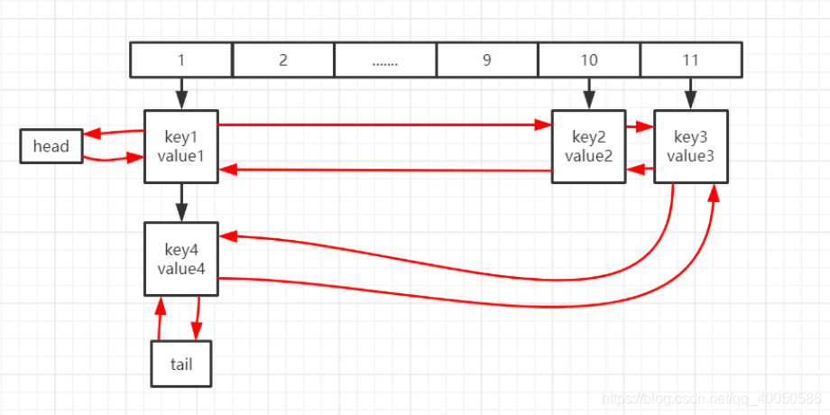
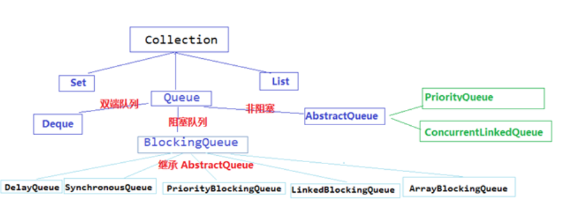
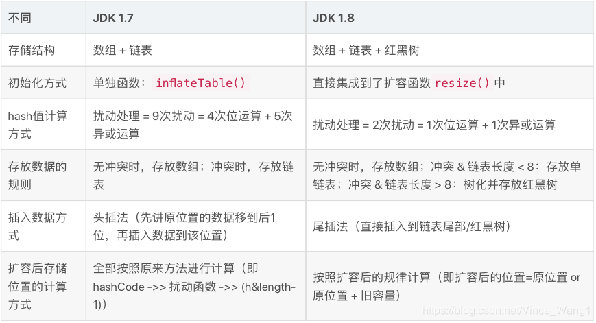

java集合框架
------------

分为Collection接口和Map接口；


>  List接口下的集合ArrayList，LinkedList，Vector，CopyOnWriteArrayList

#### ArrayList

>   	ArrayList考点没有很多，首先extends AbstractList 并实现了List接口（第一个考点：**为什么同时继承AbstractList ，又实现List**）接着就是初始化，初始化如果有传入容量就对容量进行有效性判断，如果没有，就使用默认容量（默认：10，最小也是10）。然后它的基本方法都很简单（第二个考点：**初始化时ArrayList底层数组并没有形成，而是第一次add是创建的底层数组**），基本就是对数组进行操作，如果需要扩容（第三个点：**扩容扩多少，怎么去扩**），则生成一个新的Capacity(当然其中包括了很多判断，总之不能超过Integer.MAX_VALUE )，在进行深拷贝 System.arraycopy（第四个考点：**深拷贝**），替换到新的数组中。哦对，还有一个**fast-fail机制**。

1. List接口下的一个实现，使用数组存储

2. extends AbstractList ：继承了AbstractList。为什么要先继承AbstractList，而让AbstractList先实现List？而不是让ArrayList直接实现List？
   这里是有一个思想，接口中全都是抽象的方法，而抽象类中可以有抽象方法，还可以有具体的实现方法，正是利用了这一点，让AbstractList是实现接口中一些通用的方法，而具体的类， 如ArrayList就继承这个AbstractList类，拿到一些通用的方法，然后自己在实现一些自己特有的方法，这样一来，让代码更简洁，就继承结构最底层的类中通用的方法都抽取出来，先一起实现了，减少重复代码。所以一般看到一个类上面还有一个抽象类，应该就是这个作用。

3. 实现了List接口：ArrayList的父类AbstractList也实现了List接口，那为什么子类ArrayList还是去实现一遍呢？collection 的作者Josh说他写这代码的时候觉得这个会有用处，但是其实并没什么用，但因为没什么影响，就一直留到了现在。

4. 实现了RandomAccess接口：表明ArrayList支持快速（通常是固定时间）随机访问。在ArrayList中，我们可以通过元素的序号快速获取元素对象，这就是快速随机访问。

5. 实现了Cloneable接口：实现了该接口，就可以使用Object.Clone()方法了。

6. implements java.io.Serializable：表明该类具有序列化功能，该类可以被序列化，什么是序列化？简单的说，就是能够从类变成字节流传输，然后还能从字节流变成原来的类。

   > 容量：1.7的时候是初始化就创建一个容量为10的数组，1.8后是初始化先创建一个空数组，第一次add时才扩容为10
   >
   > 构造方法：无参，int值，传入collection集合
   >
   > ```
   > trimToSize ：将list数组容量设置为实际容量
   > size（），isEmpty，contains，indexOf，lastIndexOf，clone，toArray，set，get,add(),add(int,E)（使用arraycopy来将index后面的数据放到index+1处）,remove(int)，remove(Object o)(删除指定索引或者指定元素),fastRemove，clear,addAll,removeRange(int，int),rangeCheck,removeAll,retainAll（保留指定集合的元素，删除不在的元素，调用batchRemove(c, true)删除不在的元素），listIterator(int index)（返回指定位置开始的迭代器），listIterator（功能更强大的迭代器），Iterator，Itr（hasNext，next，remove，forEachRemaining），ListItr（hasPrevious，nextIndex，previousIndex，set，add），subList，sort（legacyMergeSort归并排序或者TimSort）
   > ```

#### LinkedList

> LinkedList考点更加少，继承于AbstractSequentialList，实现了List ，Deque 接口，主要操作就是基于数据结构的链表，但注意他是双向链表，每个节点都具有pre和next两个指针，并且链表还具有first和last两个头尾指针。
>
> 构造Queue:
>
> Queue queue = new LinkedList()普通队列（add(e)，offer(e)，remove()，poll()，element()，peek()）
>
> Deque deque = new LinkedList()可用作双端队列（offerFirst(e)=addFirst(e)，pollFirst()，peekFirst()=getFirst()，offerLast(e)，pollLast()，peekLast()）和堆栈（push(e)，pop()，peek()）

> List<E>, Deque<E>, Cloneable, java.io.Serializable
>        LinkedList 是一个继承于AbstractSequentialList的双向链表。它也可以被当作堆栈、队列或双端队列进行操作。实现了Dequeue接口，
>        LinkedList 实现 List 接口，能对它进行队列操作。
>        LinkedList 实现 Deque 接口，即能将LinkedList当作双端队列使用。
>        LinkedList 实现了Cloneable接口，即覆盖了函数clone()，能克隆。
>        LinkedList 实现java.io.Serializable接口，这意味着LinkedList支持序列化，能通过序列化去传输。
>        LinkedList 是非同步的。
>
> Node是**双向链表节点所对应的数据结构**，它包括的属性有：**当前节点所包含的值**，**上一个节点**，**下一个节点**。

> 构造函数：无参和collection集合
>
> ```
> linkFirst，linkLast，linkBefore（在指定元素前加入指定元素），unlinkFirst，unlinkLast，unlink，getFirst，getLast，removeFirst，removeLast，addFirst，addLast，contains，size，add，remove，addAll，get，add(int index, E element)，isElementIndex，
> ```

#### CopyOnWriteArrayList

线程安全的ArrayList，很多时候，我们的系统应对的都是**读多写少**的并发场景。CopyOnWriteArrayList容器允许并发读，**读操作是无锁的，性能较高**。至于写操作，比如向容器中添加一个元素，**则首先加锁，再将将当前容器复制一份，然后在新副本上执行写操作，结束之后再将原容器的引用指向新容器。**

CopyOnWriteArrayList适合使用在读操作远远大于写操作的场景里，比如缓存。

缺点：

1. 写操作的时候，需要拷贝数组，会消耗内存，如果原数组的内容比较多的情况下，可能导致young gc或者full gc
2. 不能用于实时读的场景，像拷贝数组、新增元素都需要时间，,虽然CopyOnWriteArrayList 能做到最终一致性,但是还是没法满足实时性要求；

继承自List<E>, RandomAccess, Cloneable, java.io.Serializable

### Map

> Map接口下有HashMap（HashMap下面还有LinkedHashMap，ConcurrentHashMap，weakHashMap等等）,TreeMap, HashTable

#### Map架构


1.  AbstractMap 是**继承于Map的抽象类，它实现了Map中的大部分API**。其它Map的实现类可以通过继承AbstractMap来减少重复编码。
2.  SortedMap 是继承于Map的接口。SortedMap中的内容是**排序的键值对**，排序的方法是通过比较器(Comparator)。
3.   TreeMap 继承于AbstractMap，且实现了NavigableMap接口；因此，TreeMap中的内容是“**有序的键值对**”！
4.  HashMap 继承于AbstractMap，但没实现NavigableMap接口；因此，HashMap的内容是“**键值对，但不保证次序**”！
5.  Hashtable 虽然不是继承于AbstractMap，但它继承于Dictionary(Dictionary也是键值对的接口)，而且也实现Map接口；因此，Hashtable的内容也是“**键值对，也不保证次序**”。但和HashMap相比，Hashtable是线程安全的，而且它支持通过Enumeration去遍历。
6.  WeakHashMap 继承于AbstractMap。它和HashMap的键类型不同，**WeakHashMap的键是“弱键”**。

Map常见API:

>   abstract void                 clear()
>   abstract boolean              **containsKey(Object key)**
>   abstract boolean              **containsValue(Object value)**
>   abstract Set<Entry<K, V>>     **entrySet()**// 通过 entrySet() 获取Map.Entry的键值对集合，从而通过该集合实现对键值对的操作。
>   abstract boolean              equals(Object object)
>   abstract V                    **get(Object key)**//根据key返回一个Value
>   abstract int                  hashCode()
>   abstract boolean              isEmpty()
>   abstract Set<K>               keySet()
>   abstract V                    put(K key, V value)
>   abstract void                 putAll(Map<? extends K, ? extends V> map)
>   abstract V                    remove(Object key)
>   abstract int                  size()
>   abstract Collection<V>        values()//返回**值集**的**Collection集合**

#### HashMap

> hashmap考点：https://www.cnblogs.com/zengcongcong/p/11295349.html
>
> 1. 如何计算Hash，如何寻找key的位置
> 2. **为什么是16？为什么必须是2的幂？如果输入值不是2的幂比如10会怎么样？**
> 3. **谈一下当两个对象的hashCode相等时会怎么样？**

查看：[HashMap源码解析](./java集合源码分析/hashMap源码.md)

#### LinkedHashMap

由于hashMap的插入时无序的，对HashMap的迭代并不是按照其插入顺序的,所以引入了LinkedHashMap，其迭代顺序可以是插入顺序，也可以是访问顺序。因此，根据链表中元素的顺序可以将LinkedHashMap分为：**保持插入顺序的LinkedHashMap** 和 **保持访问顺序的LinkedHashMap**。


LinkedHashMap=hashMap+双向链表

也就是说对于每一个插入的entry，它的前后都与相应的节点与他相连，使用的是Pre和next，这样在便利时就能保证节点的插入顺序，但是这个顺序并不是一直不变的，会被get操作打乱，这是为了支持LRU算法而形成的。



***构造器：***四个HashMap的构造器+一个独有构造器（accessOrder为true指明是访问顺序，false:为插入顺序）

方法：

1.  containsValue(Object) 检测指定值是否在map中

```java
 // linkedHashmap 重写了此方法,但没有重写 containsKey
 // 因为key有hash优化,而value没有,只能迭代检查. 
 // hashmap 中node 要双循环, 这里则是单循环,所有做了重写
	public boolean containsValue(Object value) {
        for (LinkedHashMap.Entry<K,V> e = head; e != null; e = e.after) {
            V v = e.value;
            if (v == value || (value != null && value.equals(v)))
                return true;
        }
        return false;
    }

    
    
    // hashmap的containsValue方法
         Node<K,V>[] tab; V v;
        if ((tab = table) != null && size > 0) {
            for (Node<K,V> e : tab) {
                for (; e != null; e = e.next) {
                    if ((v = e.value) == value ||
                        (value != null && value.equals(v)))
                        return true;
                }
            }
        }
        return false;
```

get方法：

```java
// 需要在获取到key之后,根据设置,移动节点位置到最后(如果设置为访问顺序) 
public V get(Object key) {
        Node<K,V> e;
        if ((e = getNode(hash(key), key)) == null)
            return null;
        if (accessOrder)//如果按照访问顺序进行排序，则afterNodeAccess
            afterNodeAccess(e);
        return e.value;
    }
```

##### afterNodeAccess：

```java
// 将刚刚访问的节点移到最后
void afterNodeAccess(Node<K,V> e) { // move node to last
        LinkedHashMap.Entry<K,V> last;
        if (accessOrder && (last = tail) != e) {
            LinkedHashMap.Entry<K,V> p =
                (LinkedHashMap.Entry<K,V>)e, b = p.before, a = p.after;
            p.after = null;
            if (b == null)
                head = a;
            else
                b.after = a;
            if (a != null)
                a.before = b;
            else
                last = b;
            if (last == null)
                head = p;
            else {
                p.before = last;
                last.after = p;
            }
            tail = p;
            ++modCount;
        }
    }
```

afterNodeInsertion:在插入后的操作

```java
void afterNodeInsertion(boolean evict) { // possibly remove eldest
    LinkedHashMap.Entry<K,V> first;
    if (evict && (first = head) != null && removeEldestEntry(first)) {//removeEldestEntry默认一直是返回false，可以继承后重写,根据条件去移除最早的
        K key = first.key;
        removeNode(hash(key), key, null, false, true);
    }
}
```

重写了newNode方法，在新建node时将其加入链表尾部

```java
Node<K,V> newNode(int hash, K key, V value, Node<K,V> e) {
    LinkedHashMap.Entry<K,V> p =
        new LinkedHashMap.Entry<K,V>(hash, key, value, e);
    linkNodeLast(p);
    return p;
}
```

##### afterNodeRemoval:在移除节点后的操作

```java

void afterNodeRemoval(Node<K,V> e) { // unlink
    LinkedHashMap.Entry<K,V> p =
        (LinkedHashMap.Entry<K,V>)e, b = p.before, a = p.after;
    p.before = p.after = null;
    if (b == null)
        head = a;
    else
        b.after = a;
    if (a == null)
        tail = b;
    else
        a.before = b;
}
```

#### TreeMap

基于红黑树实现。有序Map

#### WeakHashMap

>   了解Java四种引用方式：强，软，弱，虚引用。

`WeakHashMap`当除了自身有对key的引用外，此key没有其他引用那么此map会**自动丢弃此值**

`WeakHashMap`的这种特性比较适合实现类似**本地、堆内缓存的存储机制**——缓存的失效依赖于GC收集器的行为

在这种Map中，key的类型是`WeakReference`。如果对应的key被回收，则这个key指向的对象会被从Map容器中移除

WeakHashMap继承了AbstractMap，实现Map接口。

>   1.  WeakHashMap是采用拉链法实现的，每一个Entry本质上是一个单向链表
>
>   2.  queue保存的是“已被GC清除”的“弱引用的键”。
>        弱引用和ReferenceQueue 是联合使用的：如果弱引用所引用的对象被垃圾回收，Java虚拟机就会把这个弱引用加入到与之关联的引用队列中
>       private final ReferenceQueue<K> queue = new ReferenceQueue<K>();
>
>       

源码：

1.  **WeakHashMap**的Entry继承了WeakReference，也就是弱引用，所以就具有了弱引用的特点。ReferenceQueue，他的作用是GC会**清理掉对象之后，**引用对象会被放到ReferenceQueue中，故ReferenceQueue存的是将要被清除的key
2.  WeakHashMap内部有一个expungeStaleEntries函数，在这个函数内部实现移除其内部不用的entry从而达到的自动释放内存的目的。因此我们每次访问WeakHashMap的时候，都会调用这个expungeStaleEntries函数清理一遍。这也就是为什么前两次调用WeakHashMap的size()方法有可能不一样的原因。下面看看是如何实现的：

```java
 // 清空table中无用键值对。原理如下：
     // (01) 当WeakHashMap中某个“弱引用的key”由于没有再被引用而被GC收回时，
     //   被回收的“该弱引用key”也被会被添加到"ReferenceQueue(queue)"中。
     // (02) 当我们执行expungeStaleEntries时，
     //   就遍历"ReferenceQueue(queue)"中的所有key
    //   然后就在“WeakReference的table”中删除与“ReferenceQueue(queue)中key”对应的键值对
     /**
     * Expunges stale entries from the table.
     */
    private void expungeStaleEntries() {
      //不断地循环清除key
        for (Object x; (x = queue.poll()) != null; ) {
            synchronized (queue) {//加锁
                @SuppressWarnings("unchecked")
                    Entry<K,V> e = (Entry<K,V>) x;
                int i = indexFor(e.hash, table.length);//计算entry在桶的位置，
                Entry<K,V> prev = table[i];
                Entry<K,V> p = prev;
              //下面就是通过遍历链表来设置值为null 来告诉垃圾回收器回收掉
           //注意WeakHashMap 和HashMap 的数据结构都是通过数组+链表组成的，只有理解了这点才知道下面的代码做了什么
              //找到指定的e将其删除，在将链表接上
                while (p != null) {
                    Entry<K,V> next = p.next;
                    if (p == e) {
                        if (prev == e)
                            table[i] = next;
                        else
                            prev.next = next;
                        // Must not null out e.next;
                        // stale entries may be in use by a HashIterator
                        e.value = null; // Help GC，找到e，value置为0帮助GC回收
                        size--;
                        break;
                    }
                    prev = p;
                    p = next;
                }
            }
        }
    }
```

（1）WeakHashMap使用（数组 + 链表）存储结构；

（2）WeakHashMap中的key是弱引用，gc的时候会被清除；

（3）每次对map的操作都会剔除失效key对应的Entry；

（4）使用String作为key时，一定要使用new String()这样的方式声明key，才会失效，其它的基本类型的包装类型是一样的；

（5）WeakHashMap常用来作为缓存使用；

#####  Collection 和 Collections 有什么区别？

1、**java.util.Collection 是一个集合接口**。它提供了对集合对象进行基本操作的通用接口方法。Collection接口在Java 类库中有很多具体的实现。Collection接口的意义是为各种具体的集合提供了最大化的统一操作方式。List，Set，Queue接口都继承Collection。直接实现该接口的类只有AbstractCollection类，该类也只是一个抽象类，提供了对集合类操作的一些基本实现。List和Set的具体实现类基本上都直接或间接的继承了该类。

2、**java.util.Collections 是一个包装类**。它包含有各种有关集合操作的静态方法（对集合的搜索、排序、线程安全化等），大多数方法都是用来处理线性表的。此类不能实例化，就像一个工具类，常用的方法有**sort**(对集合进行排序)，**shuffle**(随机生成一个排序)，**binarySearch**（查找指定集合中的元素，返回所查找元素的索引），**replaceAll**(将所有指定的元素进行替换)，**reverse**(反转集合中元素的顺序)，**copy**（将集合m中的元素复制到集合n），**fill**（将集合中所有元素替换为给定那个元素）

##### 21.HashMap 和 Hashtable 有什么区别？

HashMap允许键和值是null，而Hashtable则不允许键或者值是null。

Hashtable是同步的，也就是线程安全的，而HashMap不是，所以**HashMap更适用于单线程环境，Hashtable则适用于多线程环境**

#### Set

Set是个接口，继承自collection，iterable，

> set接口下有HashSet，TreeSet
>
> TreeSet自动排序的set,
>
> **LinkedHashSet**:根据元素的hashCode值来决定元素的存储位置，但是它同时使用链表维护元素的次序

##### HashSet

**构造函数：**1.默认无参构造2. 带集合的构造函数3.指定HashSet初始容量和加载因子的构造函数4.指定HashSet初始容量的构造函数

**来自：**实现：Set<E>, Cloneable, Serializable，继承AbstractSet

hashSet构造函数会new HashMap,也就是利用hashmap的key的唯一性来实现hashset，甚至LinkedHashSet的实现也是依赖于**`LinkedHashMap`**，`new LinkedHashMap<>()`


#### Queue



queue继承collection,iterable,

> Queue接口下有Deque(双端队列)，BlockingQueue(阻塞队列)，AbstractQueue(非阻塞队列)

接口queue中的方法:

>   add,offer,remove,poll,element，peek，都是抽象方法，需要子类去实现

 Deque<E> extends Queue

接口deque中的方法：

>   除了collection，Queue接口上继承的方法，还有自己针对双链表操作的方法，addFirst，addLast，offerFirst，offerLast，removeFirst，removeLast，pollFirst，pollLast，getFirst，getLast，peekFirst，peekLast，removeFirstOccurrence，removeLastOccurrence，descendingIterator，push，pop。


##### 22.如何决定使用 HashMap 还是 TreeMap？

##### 集合中为什么要用包装类？

集合接受的参数是引用类型的，为了兼容，需要转为引用类型才可以正常使用

##### HashMap1.7和1.8的区别是什么



##### 26.如何实现数组和 List 之间的转换？

数组转 List ，使用 JDK 中 java.util.Arrays 工具类的 asList 方法

```java
public static void testArray2List() {
	String[] strs = new String[] {"aaa", "bbb", "ccc"};
	List<String> list = Arrays.asList(strs);
	for (String s : list) {
		System.out.println(s);
	}
```

List 转数组，使用 List 的toArray方法。无参toArray方法返回Object数组，传入初始化长度的数组对象，返回该对象

```java
public static void testList2Array() {
	List<String> list = Arrays.asList("aaa", "bbb", "ccc");
	String[] array = list.toArray(new String[list.size()]);
	for (String s : array) {
		System.out.println(s);
	}
```


##### 28.Array 和 ArrayList 有何区别？

Array可以包含基本类型和对象类型，ArrayList只能包含对象类型。

Array大小是固定的，ArrayList的大小是动态变化的。

ArrayList提供了更多的方法和特性，比如：addAll()，removeAll()，iterator()等等。

对于基本类型数据，ArrayList 使用自动装箱来减少编码工作量；而当处理固定大小的基本数据类型的时候，这种方式相对比较慢，这时候应该使用Array。


##### 29.在 Queue 中 poll()和 remove()有什么区别？

1.  poll()和remove()都将**移除**并且返回对头，但是在poll()在队列为空时返回null，而remove()会抛出NoSuchElementException异常。
2.  peek()和element()都将在**不移除**的情况下返回队头，但是peek()方法在队列为空时返回null，调用element()方法会抛出NoSuchElementException异常。
3.  add()和offer()都是向队列中添加一个元素。但是如果想在一个满的队列中加入一个新元素，调用 add() 方法就会抛出一个 unchecked 异常，而调用 offer() 方法会返回 false。可以据此在程序中进行有效的判断！

##### 30.哪些集合类是线程安全的？

vector，Hashtable,ConcurrentHashMap

##### 31.迭代器 Iterator 是什么？

##### 32.Iterator 怎么使用？有什么特点？

```java
		Iterator<String> iterator = list.iterator();
        while (iterator.hasNext()) {
            String str = iterator.next();
            System.out.println(str);
        }
```


##### 33.Iterator 和 ListIterator 有什么区别？

ListIterator 继承 Iterator，且比 Iterator 有更多方法。

使用范围不同，Iterator可以迭代所有集合；ListIterator 只能用于List及其子类。
ListIterator 有 add 方法，可以向 List 中添加对象；Iterator 不能
ListIterator 有 set()方法，可以实现对 List 的修改；Iterator 仅能遍历，不能修改
ListIterator 有 hasPrevious() 和 previous() 方法，可以实现逆向遍历；Iterator不能
ListIterator 有 nextIndex() 和previousIndex() 方法，可定位当前索引的位置；Iterator不能

##### 34.怎么确保一个集合不能被修改？

final关键字可以修饰类，方法，成员变量，final修饰的类不能被继承，final修饰的方法不能被重写，final修饰的成员变量必须初始化值，如果这个成员变量是基本数据类型，表示这个变量的值是不可改变的，如果说这个成员变量是引用类型，则表示这个引用的地址值是不能改变的，但是这个引用所指向的对象里面的内容还是可以改变的

那么，我们怎么确保一个集合不能被修改？首先我们要清楚，集合（map,set,list…）都是引用类型，所以我们如果用final修饰的话，集合里面的内容还是可以修改的。

假如我们用final关键字定义了一个map集合，这时候我们往集合里面传值，第一个键值对1,1；我们再修改后，可以把键为1的值改为100，说明我们是可以修改map集合的值的。

那我们应该怎么做才能确保集合不被修改呢？我们可以采用**Collections包下的unmodifiableMap方法，通过这个方法返回的map,是不可以修改的**。他会报java.lang.UnsupportedOperationException错。同理：Collections包也提供了对list和set集合的方法。Collections.unmodifiableList(List)
Collections.unmodifiableSet(Set)

##### asList的缺陷

[asList](http://wiki.jikexueyuan.com/project/java-enhancement/java-thirtysix.html)

asList作用是**将数组转换为List**

1.  不能接受基本数据类型数组，需要转换为引用类型

2.  asList 产生的列表不可操作,该内部类提供了 size、toArray、get、set、indexOf、contains 方法，而像 add、remove 等改变 list 结果的方法从 AbstractList 父类继承过来

    

    

参考：https://github.com/h2pl/Java-Tutorial/blob/master/docs/java/collection/Java%E9%9B%86%E5%90%88%E8%AF%A6%E8%A7%A32%EF%BC%9AQueue%E5%92%8CLinkedList.md
