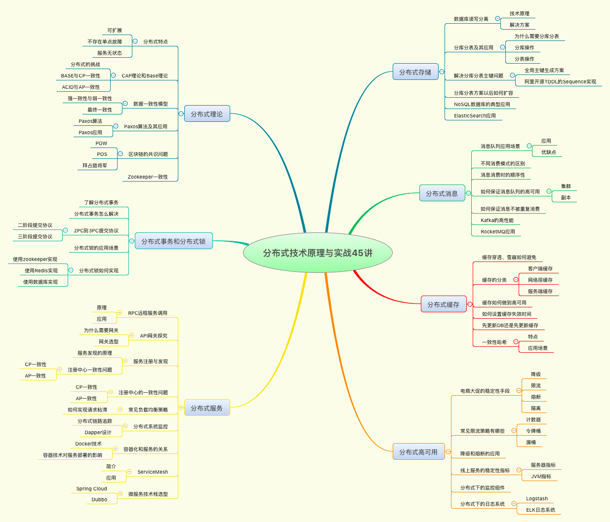

分布式系统理论
--------------




### 1.分布式ID

UUID

数据库自增ID

|                       | 描述                                         | 优点                                                         | 缺点                                                         |
| --------------------- | -------------------------------------------- | ------------------------------------------------------------ | ------------------------------------------------------------ |
| UUID                  | 通过一行代码生成的16位字符串                 | 生成足够简单，本地生成无网络消耗，具有唯一性                 | 1.不具备自增特性不好存储。2.长度过长，占用较大空间，索引效率低下 |
| 数据库自增id          |                                              | 实现简单，ID单调自增，数值类型查询速度快                     | 1.高并发场景，2.分库分表，需要改造3，自增数据量泄露          |
| 号段模式              | 每个数据库号段对应一个范围，生成对应范围的id | 不强依赖于数据库，不会频繁的访问数据库，对数据库的压力小很多 |                                                              |
| Redis自增id           | 利用`redis`的 `incr`命令实现ID的原子性自增   | 性能好                                                       | 数据丢失，自增数据量泄露                                     |
| 雪花算法（SnowFlake） | 经典的分布式id生成算法                       | 不依赖外部组件，性能好                                       | 时钟回拨                                                     |
|                       |                                              |                                                              |                                                              |

```java
/**
 * Twitter的SnowFlake算法,使用SnowFlake算法生成一个整数，然后转化为62进制变成一个短地址URL
 *
 * https://github.com/beyondfengyu/SnowFlake
 */
public class SnowFlakeShortUrl {

    /**
     * 起始的时间戳
     */
    private final static long START_TIMESTAMP = 1480166465631L;

    /**
     * 每一部分占用的位数
     */
    private final static long SEQUENCE_BIT = 12;   //序列号占用的位数
    private final static long MACHINE_BIT = 5;     //机器标识占用的位数
    private final static long DATA_CENTER_BIT = 5; //数据中心占用的位数

    /**
     * 每一部分的最大值
     */
    private final static long MAX_SEQUENCE = -1L ^ (-1L << SEQUENCE_BIT);
    private final static long MAX_MACHINE_NUM = -1L ^ (-1L << MACHINE_BIT);
    private final static long MAX_DATA_CENTER_NUM = -1L ^ (-1L << DATA_CENTER_BIT);

    /**
     * 每一部分向左的位移
     */
    private final static long MACHINE_LEFT = SEQUENCE_BIT;
    private final static long DATA_CENTER_LEFT = SEQUENCE_BIT + MACHINE_BIT;
    private final static long TIMESTAMP_LEFT = DATA_CENTER_LEFT + DATA_CENTER_BIT;

    private long dataCenterId;  //数据中心
    private long machineId;     //机器标识
    private long sequence = 0L; //序列号
    private long lastTimeStamp = -1L;  //上一次时间戳

    private long getNextMill() {
        long mill = getNewTimeStamp();
        while (mill <= lastTimeStamp) {
            mill = getNewTimeStamp();
        }
        return mill;
    }

    private long getNewTimeStamp() {
        return System.currentTimeMillis();
    }

    /**
     * 根据指定的数据中心ID和机器标志ID生成指定的序列号
     *
     * @param dataCenterId 数据中心ID
     * @param machineId    机器标志ID
     */
    public SnowFlakeShortUrl(long dataCenterId, long machineId) {
        if (dataCenterId > MAX_DATA_CENTER_NUM || dataCenterId < 0) {
            throw new IllegalArgumentException("DtaCenterId can't be greater than MAX_DATA_CENTER_NUM or less than 0！");
        }
        if (machineId > MAX_MACHINE_NUM || machineId < 0) {
            throw new IllegalArgumentException("MachineId can't be greater than MAX_MACHINE_NUM or less than 0！");
        }
        this.dataCenterId = dataCenterId;
        this.machineId = machineId;
    }

    /**
     * 产生下一个ID
     *
     * @return
     */
    public synchronized long nextId() {
        long currTimeStamp = getNewTimeStamp();
        if (currTimeStamp < lastTimeStamp) {
            throw new RuntimeException("Clock moved backwards.  Refusing to generate id");
        }

        if (currTimeStamp == lastTimeStamp) {
            //相同毫秒内，序列号自增
            sequence = (sequence + 1) & MAX_SEQUENCE;
            //同一毫秒的序列数已经达到最大
            if (sequence == 0L) {
                currTimeStamp = getNextMill();
            }
        } else {
            //不同毫秒内，序列号置为0
            sequence = 0L;
        }

        lastTimeStamp = currTimeStamp;

        return (currTimeStamp - START_TIMESTAMP) << TIMESTAMP_LEFT //时间戳部分
                | dataCenterId << DATA_CENTER_LEFT       //数据中心部分
                | machineId << MACHINE_LEFT             //机器标识部分
                | sequence;                             //序列号部分
    }
    public static void main(String[] args) {
        SnowFlakeShortUrl snowFlake = new SnowFlakeShortUrl(2, 3);

        for (int i = 0; i < (1 << 4); i++) {
            //10进制
            System.out.println(snowFlake.nextId());
        }
    }
}
```

[UUID和雪花算法](https://jasonkayzk.github.io/2020/02/09/UUID%E7%94%9F%E6%88%90%E7%AE%97%E6%B3%95-UUID%E8%BF%98%E6%98%AFsnowflake/)

### 2.分布式锁

[分布式锁](https://zhuanlan.zhihu.com/p/42056183)

##### 1.基于数据库做分布式锁

##### 2.基于 Redis 做分布式锁

[参考](http://learn.lianglianglee.com/%E4%B8%93%E6%A0%8F/%E5%88%86%E5%B8%83%E5%BC%8F%E6%8A%80%E6%9C%AF%E5%8E%9F%E7%90%86%E4%B8%8E%E5%AE%9E%E6%88%9845%E8%AE%B2-%E5%AE%8C/12%20%E5%A6%82%E4%BD%95%E4%BD%BF%E7%94%A8%20Redis%20%E5%BF%AB%E9%80%9F%E5%AE%9E%E7%8E%B0%E5%88%86%E5%B8%83%E5%BC%8F%E9%94%81%EF%BC%9F.md)

***单机情况下：***

 setnx 和 expire 命令实现加锁。

***redis集群情况下：***Redlock 算法


##### 3.基于 Redlock 做分布式锁

##### 4.基于 ZooKeeper 做分布式锁

### 3.分布式session

##### 1.session复制

##### 2.session绑定

通过Nginx配置ip-hash策略,客户端和服务器进行绑定，同一个客户端就只能访问该服务器，无论客户端发送多少次请求都被同一个服务器处理

缺点：

* 容易造成单点故障，如果有一台服务器宕机，那么该台服务器上的session信息将会丢失
* 前端不能有负载均衡，如果有，session绑定将会出问题

优点：简单

##### 基于redis存储session方案（主流）

[分布式session实现方案](https://jasonkayzk.github.io/2020/02/10/Redis%E5%AE%9E%E7%8E%B0%E5%88%86%E5%B8%83%E5%BC%8FSession/)

**利用Redis等session集中存储的实现方案：**

* 新增Filter，拦截请求，包装HttpServletRequest

* 改写getSession方法，从session存储中获取session数据，返回自定义的HttpSession实现

* 在生成新Session后，写入sessionid到cookie中

  所有服务器的session信息都存储到了同一个Redis集群中，即所有的服务都将 Session 的信息存储到 Redis 集群中，无论是对 Session 的注销、更新都会同步到集群中，达到了 Session 共享的目的

**Redis存储session的需要考虑问题：**

* session数据如何在Redis中存储？

* session属性变更何时触发存储？

  考虑到session中数据类似map的结构，采用redis中hash存储session数据比较合适，如果使用单个value存储session数据，不加锁的情况下，就会存在session覆盖的问题，因此**使用hash存储session，每次只保存本次变更session属性的数据，避免了锁处理，性能更好**

  如果每改一个session的属性就触发存储，在**变更较多session属性时会触发多次redis写操作，对性能也会有影响，我们是在每次请求处理完后，做一次session的写入，并且只写入变更过的属性**

  如果本次没有做session的更改， 是不会做redis写入的，仅当没有变更的session超过一个时间阀值（不变更session刷新过期时间的阀值），就会触发session保存，以便session能够延长有效期。

### 4.分布式缓存

##### **memcached**分布式缓存

##### Redis缓存

**总结：**

* 在实际生产中，我们通常会使用**guava cache做本地缓存**+**redis做分布式缓存**+**spring cache就集成缓存**（底层使用redis来实现）的形式
* guava cache使用在更快的获取缓存数据，同时缓存的数据量并不大的情况
* spring cache集成缓存是为了简单便捷的去使用缓存（以注解的方式即可），使用redis做其实现类是为了可以存更多的数据在机器上
* redis缓存单独使用是为了弥补spring cache集成缓存的不灵活
* 就我个人而言，如果需要使用分布式缓存，那么首先redis是必选的，因为在实际开发中，我们会缓存各种各样的数据类型，在使用了redis的同时，memcached就完全可以舍弃了，但是现在还有很多公司在同时使用memcached和redis两种缓存

### 5.分布式事务

有**XA规范**和**TCC模型**

[参考：](http://learn.lianglianglee.com/%E4%B8%93%E6%A0%8F/%E5%88%86%E5%B8%83%E5%BC%8F%E6%8A%80%E6%9C%AF%E5%8E%9F%E7%90%86%E4%B8%8E%E5%AE%9E%E6%88%9845%E8%AE%B2-%E5%AE%8C/10%20%E5%A6%82%E4%BD%95%E5%9C%A8%E4%B8%9A%E5%8A%A1%E4%B8%AD%E4%BD%93%E7%8E%B0%20TCC%20%E4%BA%8B%E5%8A%A1%E6%A8%A1%E5%9E%8B%EF%BC%9F.md)

#### XA规范

XA 是由 X/Open 组织提出的分布式事务规范，XA 规范主要定义了事务协调者（Transaction Manager）和资源管理器（Resource Manager）之间的接口。是两阶段提交的一种实现方式，根据 2PC 的规范，XA 将一次事务分割成了两个阶段，即 Prepare 和 Commit 阶段。

MySQL 中 XA 事务有两种情况，内部 XA 和外部 XA;**内部XA**是mysql通过bin log和redo log来维护系统的一致性

**外部 XA** 就是典型的分布式事务，MySQL 支持 XA START/END/PREPARE/Commit 这些 SQL 语句，通过使用这些命令，可以完成分布式事务。

#### TCC模型

TCC 提出了一种新的事务模型，基于业务层面的事务定义，锁粒度完全由业务自己控制，目的是解决复杂业务中，跨表跨库等大颗粒度资源锁定的问题。TCC 把事务运行过程分成 Try、Confirm / Cancel 两个阶段，每个阶段的逻辑由业务代码控制，避免了长事务，可以获取更高的性能。


### 6.分布式一致性

为了保证分布式系统中多个节点中数据的数值是一致的

分布式系统中存在 CAP 问题 **一致性**（ C onsistency）、**可用性**（ A vailability），以及**分区容错性**（ P artition Tolerance）

`CAP理论`:在分布式系统中 C、A、P 这三个特征不能同时满足，只能满足其中两个。

由此引出的多个分布式系统方案`保 CA 弃 P`,`保 CP 弃 A`,`保 AP 弃 C`,他们适用于不同的分布式场景

参考：[CAP理论详细分析](https://blog.csdn.net/weixin_39876592/article/details/112262702)

`BASE理论`:BASE是Basically Available（基本可用）、Soft state（软状态）和Eventually consistent（最终一致性）三个短语的缩写，base理论说即使无法做到强一致性，但每个应用都可以根据自身业务特点，采用适当的方式来使系统达到最终一致性。

***1. 基本可用***:
 基本可用是指分布式系统在出现不可预知故障的时候，允许损失部分可用性。注意，这绝不等价于系统不可用。比如：

（1）响应时间上的损失。正常情况下，一个在线搜索引擎需要在0.5秒之内返回给用户相应的查询结果，但由于出现故障，查询结果的响应时间增加了1~2秒

（2）系统功能上的损失：正常情况下，在一个电子商务网站上进行购物的时候，消费者几乎能够顺利完成每一笔订单，但是在一些节日大促购物高峰的时候，由于消费者的购物行为激增，为了保护购物系统的稳定性，部分消费者可能会被引导到一个降级页面。

***2、软状态***:
 软状态指允许系统中的数据存在中间状态，并认为该中间状态的存在不会影响系统的整体可用性，即允许系统在不同节点的数据副本之间进行数据同步的过程存在延时。

***3、最终一致性***:
 最终一致性强调的是所有的数据副本，在经过一段时间的同步之后，最终都能够达到一个一致的状态。因此，最终一致性的本质是需要系统保证最终数据能够达到一致，而不需要实时保证系统数据的强一致性。

##### 两阶段提交**协议**（2PC：Two-Phase Commit）

##### 三阶段提交**协议**（3PC：Three-Phase Commit）

##### Raft**算法**

##### paxos**算法**

### 7.分布式远程调用RPC

### 微服务

##### API网关

在微服务架构中，一个大应用被拆分成多个小的服务，这些微服务自成体系，可以独立部署和提供对外服务。一般来说，微服务的调用规范主要有 RPC 和 Restful API 两种，**API 网关**主要针对的是后面一种，也就是以 Spring Cloud 为代表的微服务解决方案。常用的网关实现：Spring Cloud Zuul 和 Spring Cloud Gateway

##### 服务注册和发现

服务注册与发现就是保证当服务上下线发生变更时，服务消费者和服务提供者能够保持正常通信。

在服务启动时，服务提供者会向注册中心注册服务，暴露自己的地址和端口等，注册中心会更新服务列表。服务消费者启动时会向注册中心请求可用的服务地址，并且在本地缓存一份提供者列表，这样在注册中心宕机时仍然可以正常调用服务。

如果提供者集群发生变更，注册中心会将变更推送给服务消费者，更新可用的服务地址列表。

在目前的微服务解决方案中，有三种典型的服务发现组件，分别是 **ZooKeeper、Eureka 和 Nacos。**

##### 分布式调用跟踪

