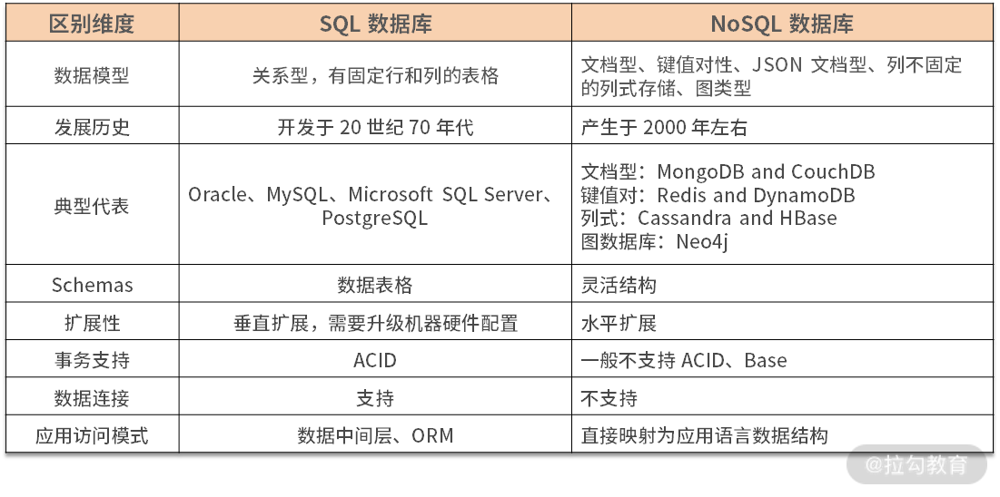

##### SQL和NoSQL比较

##### NoSql数据库

常见的 NoSQL 数据库包括<u>键值数据库</u>、<u>列族数据库</u>、<u>文档数据库</u>和<u>图形数据库</u>，其具体分类和特点如表所示。

| 分类       | 相关产品                   | 应用场景                                                     | 数据模型                              | 优点                                  |
| ---------- | -------------------------- | ------------------------------------------------------------ | ------------------------------------- | ------------------------------------- |
| 键值数据库 | Redis、Memcached、Riak     | 内容缓存，如会话、配置文件、参数等； 频繁读写、拥有简单数据模型的应用 | <key,value> 键值对，通过散列表来实现  | 扩展性好，灵活性好，大量操作时性能高  |
| 列族数据库 | Bigtable、HBase、Cassandra | 分布式数据存储与管理                                         | 以列族式存储，将同一列数据存在一起    | 可扩展性强，查找速度快，复杂性低      |
| 文档数据库 | MongoDB、CouchDB           | Web 应用，存储面向文档或类似半结构化的数据                   | <key,value>  value 是 JSON 结构的文档 | 数据结构灵活，可以根据 value 构建索引 |
| 图形数据库 | Neo4j、InfoGrid            | 社交网络、推荐系统，专注构建关系图谱                         | 图结构                                | 支持复杂的图形算法                    |

