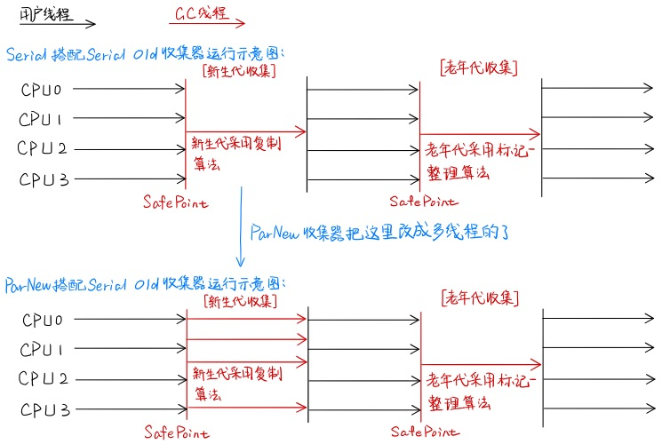

# 垃圾收集 (GC)

垃圾收集（Garbage Collection，GC），它的任务是解决以下 3 件问题：

- 哪些内存需要回收？
- 什么时候回收？
- 如何回收？

其中第一个问题很好回答，在 Java 中，GC 主要发生在 Java 堆和方法区中，对于后两个问题，我们将在之后的内容中进行讨论，并介绍 HotSpot 的 7 个垃圾收集器。

<!-- TOC -->

- [垃圾收集 (GC)](#垃圾收集-gc)
    - [概述](#概述)
    - [判断对象的生死](#判断对象的生死)
        - [判断对象是否可用的算法](#判断对象是否可用的算法)
            - [引用计数算法](#引用计数算法)
            - [可达性分析算法（主流）](#可达性分析算法主流)
        - [四种引用类型](#四种引用类型)
        - [宣告对象死亡的两次标记过程](#宣告对象死亡的两次标记过程)
        - [方法区的回收](#方法区的回收)
    - [垃圾收集算法](#垃圾收集算法)
        - [基础：标记 - 清除算法](#基础标记---清除算法)
        - [解决效率问题：复制算法](#解决效率问题复制算法)
        - [解决空间碎片问题：标记 - 整理算法](#解决空间碎片问题标记---整理算法)
        - [进化：分代收集算法](#进化分代收集算法)
    - [HotSpot 中 GC 算法的实现](#hotspot-中-gc-算法的实现)
    - [7 个垃圾收集器](#7-个垃圾收集器)
        - [Serial / ParNew 搭配 Serial Old 收集器](#serial--parnew-搭配-serial-old-收集器)
        - [Parallel 搭配 Parallel Scavenge 收集器](#parallel-搭配-parallel-scavenge-收集器)
        - [CMS 收集器](#cms-收集器)
        - [G1 收集器](#g1-收集器)
    - [GC 日志解读](#gc-日志解读)

<!-- /TOC -->
## 概述：
1）程序计数器，虚拟机栈，本地方法栈这些随着线程而生，随线程而灭，栈中的栈帧随方法的进栈退栈而存在，这些私有内存不考虑垃圾回收。

2）Java堆和方法区的内存的回收和分配都是动态的 ，垃圾收集关注的也是这部分内容。
## 判断对象的生死


什么时候回收对象？当然是这个对象再也不会被用到的时候回收。所以要想解决 “什么时候回收？” 这个问题，我们要先能判断一个对象什么时候什么时候真正的 “死” 掉了，判断对象是否可用主要有以下两种方法。

### 判断对象是否可用的算法

#### 引用计数算法

- **算法描述：**
	- 给对象添加一个引用计数器；
	- 每有一个地方引用它，计数器加 1；
	- 引用失效时，计数器减 1；
	- 计数器值为 0 的对象不再可用。
- **优点：**
	- 原理简单
	- 效率高
	- 微软COM技术，FlashPlayer等
- **缺点：**
    - 占用额外的空间
	- 很难解决循环引用的问题。即 `objA = objB; objB = objA;`，objA 和 objB 都不会再被访问后，它们仍然相互引用着对方，所以它们的引用计数器不为 0，将永远不能被判为不可用。

#### 可达性分析算法（主流）

- **算法描述：**
	- 从 "GC Root" 对象作为起点开始向下搜索，走过的路径称为引用链（Reference Chain）；
	- 从 "GC Root" 开始，不可达的对象被判为不可用。
- **Java 中可作为 “GC Root” 的对象：**
	- 栈中（本地变量表中的reference）
		- 虚拟机栈中，栈帧中的本地变量表引用的对象；
		- 本地方法栈中，JNI 引用的对象（native方法）；
	- 方法区中
		- 类的静态属性引用的对象；
		- 常量引用的对象；

即便如此，一个对象也不是一旦被判为不可达，就立即死去的，宣告一个的死亡需要经过两次标记过程。

### 四种引用类型

JDK 1.2 后，Java 中才有了后 3 种引用的实现。

- **强引用：** 像 `Object obj = new Object()` 这种，只要强引用还存在，垃圾收集器就永远不会回收掉被引用的对象。
- **软引用：** 用来引用还存在但非必须的对象。对于软引用对象，在 OOM 前，虚拟机会把这些对象列入回收范围中进行第二次回收，如果这次回收后，内存还是不够用，就 OOM。实现类：`SoftReference`。
- **弱引用：** 被弱引用引用的对象只能生存到下一次垃圾收集前，一旦发生垃圾收集，被弱引用所引用的对象就会被清掉。实现类：`WeakReference`。
- **虚引用：** 幽灵引用，对对象没有半毛钱影响，甚至不能用来取得一个对象的实例。它唯一的用途就是：当被一个虚引用引用的对象被回收时，系统会收到这个对象被回收了的通知。实现类：`PhantomReference`。

### 宣告对象死亡的两次标记过程

- 当发现对象不可达后，该对象被第一次标记，并进行是否有必要执行 `finalize()` 方法的判断；
	- 不需要执行：对象没有覆盖 `finalize()` 方法，或者 `finalize()` 方法已被执行过（`finalize()` 只被执行一次）；
	- 需要执行：将该对象放置在一个队列中，稍后由一个虚拟机自动创建的低优先级线程执行。
- `finalize()` 方法是对象逃脱死亡的最后一次机会，不过虚拟机不保证等待 `finalize()` 方法执行结束，也就是说，虚拟机只触发 `finalize()` 方法的执行，如果这个方法要执行超久，那么虚拟机并不等待它执行结束，所以最好不要用这个方法。
- `finalize()` 方法能做的，try-finally 都能做，所以忘了这个方法吧！

### 方法区的回收

永久代的 GC 主要回收：**废弃常量** 和 **无用的类**。

- 废弃常量：例如一个字符串 "abc"，当没有任何引用指向 "abc" 时，它就是废弃常量了。
- 无用的类：同时满足以下 3 个条件的类。
	- 该类的所有实例已被回收，Java 堆中不存在该类的任何实例；
	- 加载该类的 Classloader 已被回收；
	- 该类的 Class 对象没有被任何地方引用，即无法在任何地方通过反射访问该类的方法。


## 垃圾收集算法


### 基础：标记 - 清除算法

- **算法思路：**
	- 先标记出所有需要回收的对象（图中深色区域）；
	- 标记完后，统一回收所有被标记对象（留下狗啃似的可用内存区域……）。
- **不足：**
	- 效率问题：标记和清理两个过程的效率都不高。
	- 空间碎片问题：标记清除后会产生大量不连续的内存碎片，导致以后为较大的对象分配内存时找不到足够的连续内存，会提前触发另一次 GC。


### 解决效率问题：复制算法

- **算法思路：**
  - 通过一系列称为“GCRoots”的根对象作为**起始节点集**，从这些节点开始，根据引用关系向下搜索，搜索过程所走过的路径称为“==引用链==”（Reference Chain），如果某个对象到GC Roots间没有任何引用链相连，或者用图论的话来说就是从GC Roots到这个对象不可达时，则证明此对象是不可能再被使用的。
- **与GCroot对象关联：**  

在Java技术体系里面，固定可作为GCRoots的对象包括以下几种：
- 在虚拟机栈（栈帧中的本地变量表）中引用的对象，譬如各个线程被调用的方法堆栈中使用到的参数、局部变量、临时变量等。
- 在方法区中类==静态属性引用的对象==，譬如Java类的引用类型静态变量。·在方法区中常量引用的对象，譬如字符串常量池（String Table）里的引用。
- 在本地方法栈中JNI（即通常所说的Native方法）引用的对象。
- java虚拟机内部的引用，如基本数据类型对应的Class对象，一些常驻的异常对象（比如NullPointExcepiton、OutOfMemoryError）等，还有系统类加载器。
- 所有被同步锁（synchronized关键字）持有的对象。
- 反映Java虚拟机内部情况的JMXBean、JVMTI中注册的回调、本地代码缓存等
- 根据用户所选用的垃圾收集器以及当前回收的内存区域不同，还可以有其他对象“临时性”地加入，譬如后文将会提到的分代收集和局部回收(Partial GC)

### 再谈引用

#### ==传统引用==：
如果reference类型的数据中存储的数值代表的是另外一块内存的起始地址，就称该reference数据是代表某块内存、某个对象的引用。(==但使用场景局限==：譬如：当内存空间还足够时，能保留在内存之中，如果内存空间在进行垃圾收集后仍然紧张，那就可以抛弃这些对象)  
#### ==jdk1.2扩充==：
强引用（StronglyRe-ference传统引用）  
软引用（Soft Reference内存足够不回收，内存紧张进行二次回收）  
弱引用（Weak Reference被弱引用关联的对象只能生存到下一次垃圾收集发生为止，下次垃圾回收时不管内存够不够都回收）  
虚引用（Phantom Reference幽灵引用”或者“幻影引用，设置虚引用关联的唯一目的只是为了能在这个对象被收集器回收时收到一个系统通知）
### 生存还是死亡？
对象完全被回收过程：
1. 进行可达性分析后发现没有与GCRoots相连接的引用链，被第一次标记
2. 随后进行一次筛选，筛选的条件是此对象是否有必要执行finalize()方法
3. 假如对象没有覆盖finalize()方法，或者finalize()方法已经被虚拟机调用过，那么虚拟机将这两种情况都视为“没有必要执行”。
4. 如果这个对象被判定为确有必要执行finalize()方法，那么该对象将会被放置在一个名为F-Queue的队列之中，并在稍后由一条由虚拟机自动建立的、低调度优先级的Finalizer线程去执行它们的finalize()方法  

<font color='red'> 总之：也就是说对象能够在GC中自我拯救，但机会只有一次，因为对象的finalize()方法最多被调用一次 ，但没有特殊要求，不建议使用finalize进行拯救</font>
### 回收方法区

方法区的垃圾收集主要回收两部分内容：<font color='red'>废弃的常量和不再使用的类型</font>  

==废弃的常量==：  
已经没有任何字符串对象引用常量池中的常量，且虚拟机中也没有其他地方引用这个字面量  

==不再使用的类型：==
1. 该类所有的实例都已经被回收，也就是Java堆中不存在该类及其任何派生子类的实例。
2. 加载该类的类加载器已经被回收，这个条件除非是经过精心设计的可替换类加载器的场景，如OSGi、JSP的重加载等，否则通常是很难达成的。
3. 该类对应的java.lang.Class对象没有在任何地方被引用，无法在任何地方通过反射访问该类的方法。

## 垃圾回收算法
垃圾收集算法可以划分为“==引用计数式垃圾收集==”（Reference Counting GC）和“==追踪式垃圾收集==”（Tracing GC）两大类

### 分代收集理论
1）**弱分代假说**（Weak Generational Hypothesis）：绝大多数对象都是朝生夕灭的。  
2）**强分代假说**（Strong Generational Hypothesis）：熬过越多次垃圾收集过程的对象就越难以消亡。  

由以上垃圾分代假说引出的收集器设计原则----（收集器应该将Java堆划分出不同的区域，然后将回收对象依据其年龄（年龄即对象熬过垃圾收集过程的次数）分配到不同的区域之中存储，因而才有了“Minor GC”“Major GC”“Full GC”这样的回收类型的划分）

但是！上述原则会有一个问题就是---对象不是孤立的，对象之间会存在跨代引用，新生代中的对象是可能被老年代引用的
#### 跨代引用

在新生代上建立一个全局的数据结构（该结构被称为“记忆集”，Remembered Set），把老年代划分成若干小块，标识出老年代的哪一块内存会存在跨代引用。 

此后当发生MinorGC时，只有包含了跨代引用的小块内存里的对象才会被加入到GCRoots进行扫描。虽然这种方法会增加一些运行时的开销，但比起收集时扫描整个老年代来说仍然是划算的。


垃圾收集定义：
```
* 部分收集（PartialGC）：指目标不是完整收集整个Java堆的垃圾收集，其中又分为：
    * 新生代收集（Minor GC/Young GC）：指目标只是新生代的垃圾收集。
    * 老年代收集（Major GC/Old GC）：指目标只是老年代的垃圾收集。目前只有CMS收集器会有单独收集老年代的行为。另外请注意“Major GC”这个说法现在有点混淆，在不同资料上常有不同所指，读者需按上下文区分到底是指老年代的收集还是整堆收集。
    * 混合收集（Mixed GC）：指目标是收集整个新生代以及部分老年代的垃圾收集。目前只有G1收集器会有这种行为。
* 整堆收集（Full GC）：收集整个Java堆和方法区的垃圾收集。
```
###  标记-清除算法（1960年）
#### **算法过程**
标记所有需要回收的对象，标记完成后，统一回收掉所有被标记的对象，（也可以反过来，标记存活的对象，统一回收所有未被标记的对象。**标记过程就是对象是否属于垃圾的判定过程**）
#### **缺点**
- ==执行效率不稳定==，如果Java堆中包含大量对象，而且其中大部分是需要被回收的，这时必须进行大量标记和清除的动作，导致耗费大量的时间；
- ==内存空间的碎片化问题==，标记、清除之后会产生大量不连续的内存碎片，导致当以后在程序运行过程中需要分配较大对象时无法找到足够的连续内存而不得不提前触垃圾收集动作

### 标记-复制算法（1969年）
**1.最初的标记复制算法：**

1969年Fenichel提出了一种称为“半区复制”（Semispace Copying）的垃圾收集算法，它将可用内存按容量划分为大小相等的两块，每次只使用其中的一块。当这一块的内存用完了，就将还存活着的对象复制到另外一块上面，然后再把已使用过的内存空间一次清理掉
**
2.根据对象朝生夕灭的特点优化的算法：**

“Appel式回收算法”。Appel式回收是把新生代分为一块较大==的Eden空间和两块较小的Survivor空间==，每次分配内存只使用Eden和其中一块Survivor。发生垃圾搜集时，将Eden和Survivor中仍然存活的对象一次性复制到另外一块Survivor空间上，然后直接清理掉Eden和已用过的那块Survivor空间。HotSpot虚拟机默认Eden和Survivor的大小比例是8∶1，也即每次新生代中可用内存空间为整个新生代容量的90%（Eden的80%加上一个Survivor的10%），只有一个Survivor空间，即10%的新生代是会被“浪费”的

### 标记-整理算法（1974年）
#### 算法过程
根据老年代特点，让所有存活的对象都向内存空间一端移动，然后直接清理掉边界以外的内存


## HotSpot的算法细节实现  （未完成）


### 进化：分代收集算法

- **新生代：** GC 过后只有少量对象存活 —— **复制算法**
- **老年代：** GC 过后对象存活率高 —— **标记 - 整理算法**


## HotSpot 中 GC 收集器

通过前两小节对于判断对象生死和垃圾收集算法的介绍，我们已经对虚拟机是进行 GC 的流程有了一个大致的了解。但是，在 HotSpot 虚拟机中，对于如何高效的实现这些算法，不同的厂商就会有差别，本章介绍目前正在使用的，以及未来将要使用的几个垃圾回收算法。


通过之前的分析，GC 算法的实现流程简单的来说分为以下两步：

1. 找到死掉的对象；
2. 把它清了。

想要找到死掉的对象，我们就要进行可达性分析，也就是从 GC Root 找到引用链的这个操作。

也就是说，进行可达性分析的第一步，就是要枚举 GC Roots，这就需要虚拟机知道哪些地方存放着对象应用。如果每一次枚举 GC Roots 都需要把整个栈上位置都遍历一遍，那可就费时间了，毕竟并不是所有位置都存放在引用呀。所以为了提高 GC 的效率，HotSpot 使用了一种 OopMap 的数据结构，**OopMap 记录了栈上本地变量到堆上对象的引用关系**，也就是说，GC 的时候就不用遍历整个栈只遍历每个栈的 OopMap 就行了。

在 OopMap 的帮助下，HotSpot 可以快速准确的完成 GC 枚举了，不过，OopMap 也不是万年不变的，它也是需要被更新的，当内存中的对象间的引用关系发生变化时，就需要改变 OopMap 中的相应内容。可是能导致引用关系发生变化的指令非常之多，如果我们执行完一条指令就改下 OopMap，这 GC 成本实在太高了。

因此，HotSpot 采用了一种在 “安全点” 更新 OopMap 的方法，安全点的选取既不能让 GC 等待的时间过长，也不能过于频繁增加运行负担，也就是说，我们既要让程序运行一段时间，又不能让这个时间太长。我们知道，JVM 中每条指令执行的是很快的，所以一个超级长的指令流也可能很快就执行完了，所以 **真正会出现 “长时间执行” 的一般是指令的复用，例如：方法调用、循环跳转、异常跳转等**，虚拟机一般会将这些地方设置为安全点更新 OopMap 并判断是否需要进行 GC 操作。

此外，在进行枚举根节点的这个操作时，为了保证准确性，我们需要在一段时间内 “冻结” 整个应用，即 Stop The World（传说中的 GC 停顿），因为如果在我们分析可达性的过程中，对象的引用关系还在变来变去，那是不可能得到正确的分析结果的。即便是在号称几乎不会发生停顿的 CMS 垃圾收集器中，枚举根节点时也是必须要停顿的。这里就涉及到了一个问题：

**我们让所有线程跑到最近的安全点再停顿下来进行 GC 操作呢？**

主要有以下两种方式：

- 抢先式中断：
	- 先中断所有线程；
	- 发现有线程没中断在安全点，恢复它，让它跑到安全点。
- **主动式中断：** (主要使用)
	- 设置一个中断标记；
	- 每个线程到达安全点时，检查这个中断标记，选择是否中断自己。

除此安全点之外，还有一个叫做 “安全区域” 的东西，一个一直在执行的线程可以自己 “走” 到安全点去，可是一个处于 Sleep 或者 Blocked 状态的线程是没办法自己到达安全点中断自己的，我们总不能让 GC 操作一直等着这些个 ”不执行“ 的线程重新被分配资源吧。对于这种情况，我们要依靠安全区域来解决。

**安全区域是指在一段代码片段之中，引用关系不会发生变化，因此在这个区域中的任意位置开始 GC 都是安全的。**

当线程执行到安全区域时，它会把自己标识为 Safe Region，这样 JVM 发起 GC 时是不会理会这个线程的。当这个线程要离开安全区域时，它会检查系统是否在 GC 中，如果不在，它就继续执行，如果在，它就等 GC 结束再继续执行。

本小节我们主要讲述 HotSpot 虚拟机是如何发起内存回收的，也就是如何找到死掉的对象，至于如何清掉这些个对象，HotSpot 将其交给了一堆叫做 ”GC 收集器“ 的东西，这东西又有好多种，不同的 GC 收集器的处理方式不同，适用的场景也不同，我们将在下一小节进行详细讲述。


## 7 个垃圾收集器

垃圾收集器就是内存回收操作的具体实现，HotSpot 里足足有 7 种，为啥要弄这么多，因为它们各有各的适用场景。有的属于新生代收集器，有的属于老年代收集器，所以一般是搭配使用的（除了万能的 G1）。关于它们的简单介绍以及分类请见下图。


### Serial / ParNew 搭配 Serial Old 收集器



Serial 收集器是虚拟机在 Client 模式下的**默认新生代收集器**，它的优势是简单高效，在单CPU模式下很牛。  

Serial Old收集器是Serial收集器的**老年代版本**，它同样是一个**单线程收集器**，使用**标记-整理**算法。这个收集器的主要意义也是供**客户端模式下的HotSpot虚拟机使用**,


```
如果在服务端模式下，它也可能有两种用途：
* 一种是在JDK 5以及之前的版本中与ParallelScavenge收集器搭配使用
* 另外一种就是作为CMS收集器发生失败时的后备预案
```


ParNew 收集器就是 Serial 收集器的多线程版本，虽然除此之外没什么创新之处，但它却是许多运行在 服务器端模式下的虚拟机中的首选新生代收集器，因为除了 Serial 收集器外，只有它能和 CMS 收集器搭配使用。

    但自JDK9开始，ParNew加CMS收集器的组合就不再是官方推荐的
    服务端模式下的收集器解决方案了。官方希望它能完全被G1所取 
    代，甚至还取消了ParNew加Serial 
    Old以及Serial加CMS这两组收集器组合的支持，并直接取消了-XX
    ：+UseParNewGC参数，这意味着ParNew和CMS从此只能互相搭配使
    用。

### Parallel 搭配 Parallel Scavenge 收集器

首先，这俩货肯定是要搭配使用的，不仅仅如此，它俩还贼特别，它们的关注点与其他收集器不同，其他收集器关注于尽可能缩短垃圾收集时用户线程的停顿时间，而 Parallel Scavenge 收集器的目的是达到一个可控的吞吐量。

> 吞吐量 = 运行用户代码时间 / ( 运行用户代码时间 + 垃圾收集时间 )

因此，Parallel Scavenge收集器是一款基于标记复制算法的收集器，目标是达到一个**可控制的吞吐量**，Parallel Scavenge 收集器不管是新生代还是老年代都是多个线程同时进行垃圾收集，十分适合于应用在注重吞吐量以及 CPU 资源敏感的场合。

```
* 注意：如果读者对于收集器运作不太了解，手工优化存在困难
的话，  使用Parallel Scavenge收集器配合自适应调节策略，把内存管理的调优任务交给虚拟机去完成也许是一个很不错的选择。
只需要把基本的内存数据设置好（如-Xmx设置最大堆），
然后使用-XX：MaxGCPauseMillis参数（更关注最大停顿时间）或-XX：GCTimeRatio（更关注吞吐量）参数给虚拟机设立一个优化目标，
那具体细节参数的调节工作就由虚拟机完成了。
**自适应调节策略也是ParallelScavenge收集器区别于ParNew收集器的一个重要特性。**
```

可调节的虚拟机参数：

- `-XX:MaxGCPauseMillis`：最大 GC 停顿的秒数；
- `-XX:GCTimeRatio`：吞吐量大小，一个 0 ~ 100 的数，`最大 GC 时间占总时间的比率 = 1 / (GCTimeRatio + 1)`；
- `-XX:+UseAdaptiveSizePolicy`：一个开关参数，打开后就无需手工指定 `-Xmn`，`-XX:SurvivorRatio` 等参数了，虚拟机会根据当前系统的运行情况收集性能监控信息，自行调整。

### Parallel Old收集器
是Parallel Scavenge收集器的老年代版本，支持多线程并发收集，基于标记-整理算法实现。这个收集器是直到JDK 6时才开始提供的,用来搭配Parallel Scavenge收集器的，更大的发挥他们的性能
### CMS 收集器
思想：以获取最短回收停顿时间为目标，基于标记-清除算法实现的


**参数设置：**

- `-XX:+UseCMSCompactAtFullCollection`：在 CMS 要进行 Full GC 时进行内存碎片整理（默认开启）
- `-XX:CMSFullGCsBeforeCompaction`：在多少次 Full GC 后进行一次空间整理（默认是 0，即每一次 Full GC 后都进行一次空间整理）

> **关于 CMS 使用 标记 - 清除 算法的一点思考：**
>
> 之前对于 CMS 为什么要采用 标记 - 清除 算法十分的不理解，既然已经有了看起来更高级的 标记 - 整理 算法，那 CMS 为什么不用呢？最近想了想，感觉可能是这个原因，不过也不是很确定，只是个人的一种猜测。
>
> 标记 - 整理 会将所有存活对象向一端移动，然后直接清理掉边界以外的内存。这就意味着需要一个指针来维护这个分隔存活对象和无用空间的点，而我们知道 CMS 是并发清理的，虽然我们启动了多个线程进行垃圾回收，不过如果使用 标记 - 整理 算法，为了保证线程安全，在整理时要对那个分隔指针加锁，保证同一时刻只有一个线程能修改它，**加锁的这一过程相当于将并行的清理过程变成了串行的，也就失去了并行清理的意义了。**
>
> 所以，CMS 采用了 标记 - 清除 算法。

### G1 收集器


## GC 日志解读

