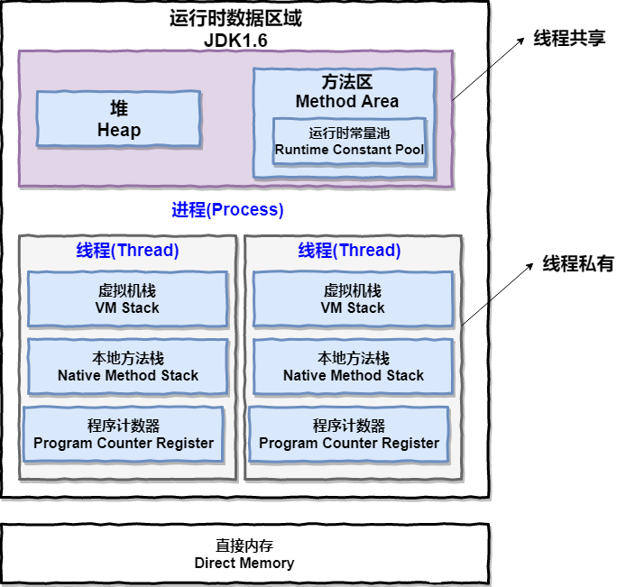

### JVM

#### 1. 垃圾回收算法分类

从垃圾回收算法实现主要分为复制（copy）、标记清除（mark-sweep）和标记压缩（mark-compact）

从回收方式上可以分为串行回收、并行回收、并发回收（CMS,G1,ZGC,Shenandoah）

从内存管理上可以分为代管理和非代管理。

#### 2. CMS垃圾回收

初始标记、并发标记、重新标记、并发清除

#### 3. G1垃圾回收

跳出了之前回收器的分代行为，可以面向堆内存的任何部分来组成垃圾回收，分成不同的区，这些区可以组成不同大小的Eden空间，Survivor空间，老年代空间，还有humongous区域来存储大对象

1. 跨Region对象怎么解决
2. 并发标记阶段如何保证收集线程和用户线程互不干扰
3. 怎样建立起可靠的停顿预测模型

分为·初始标记，·并发标记·最终标记，筛选回收

#### CMS和G1的优缺点

#### 吞吐量优先和响应时间优先的回收器有哪些？

吞吐量=（运行用户代码）/(用户代码+垃圾收集)

**新生代：**

Serial收集器：简单高效，会stop the world 适合单核服务器

ParNew收集器：多线程的serial

Parallel Scavenge：多线程收集器，也是采用复制算法。 Parallel Scavenge收集器的目的是达到一个**可控制的吞吐量**，而ParNew收集器关注点在于尽可能的缩短垃圾**收集时用户线程的停顿时间***。

**老年代：**

Serial Old：

Parallel Old收集器：

CMS收集器：重视服务器响应速度，要求系统停顿时间最短

G1收集器：G1能建立可预测的时间停顿模型，能让使用者明确指定一个长度为M毫秒的时间片段内，消耗在垃圾收集上的时间不得超过N毫秒。
#### 到底多大的对象会被直接扔到老年代？

#### 讲一下CMS的流程

#### 听说过CMS的并发预处理和并发可中断预处理吗

- CMS并发预处理——并发标记
- CMS并发可中断预处理——重新标记

1、CMS是一个关注停顿时间，以回收停顿时间最短为目标的垃圾回收器。并发预处理阶段做的工作是标记，重标记需要STW（Stop The World），因此重标记的工作尽可能多的在并发阶段完成来减少STW的时间。此阶段标记**从新生代晋升的对象、新分配到老年代的对象以及在并发阶段被修改了的对象**。
		2、并发可中断预清理(Concurrent precleaning)是标记**在并发标记阶段引用发生变化的对象**，如果发现对象的引用发生变化，则JVM会标记堆的这个区域为Dirty Card。那些能够从Dirty Card到达的对象也被标记（标记为存活），当标记做完后，这个Dirty Card区域就会消失。CMS有两个参数：CMSScheduleRemarkEdenSizeThreshold、CMSScheduleRemarkEdenPenetration，默认值分别是2M、50%。两个参数组合起来的意思是预清理后，eden空间使用超过2M时启动可中断的并发预清理（CMS-concurrent-abortable-preclean），直到eden空间使用率达到50%时中断，进入重新标记阶段

#### CMS和G1的异同

#### G1什么时候引发FullGC

**Minor GC:**新生代的垃圾收集

**Major GC:**老年代的垃圾收集。目前只有CMS收集器会有单独收集老年代的行为。

**Mixed GC：**指目标是收集**整个新生代以及部分老年代**的垃圾收集。目前只有G1收集器会有这种行为。

**Full GC:**收集整个Java堆和方法区的垃圾收集

1. System.gc() 方法的调用 
   此方法的调用是建议 JVM 进行 Full GC，注意这**只是建议而非一定**，但在很多情况下它会触发 Full GC，从而增加 Full GC 的频率。通常情况下我们只需要让虚拟机自己去管理内存即可，我们可以通过 -XX:+ DisableExplicitGC 来禁止调用 System.gc()。

2. 老年代空间不足 
   老年代空间不足会触发 Full GC 操作，若进行该操作后空间依然不足，则会抛出如下错误： 
   `java.lang.OutOfMemoryError: Java heap space`

3. 永久代空间不足 
   JVM 规范中运行时数据区域中的方法区，在 HotSpot 虚拟机中也称为永久代（Permanet Generation），存放一些类信息、常量、静态变量等数据，当系统要加载的类、反射的类和调用的方法较多时，永久代可能会被占满，会触发 Full GC。如果经过 Full GC 仍然回收不了，那么 JVM 会抛出如下错误信息： 
   `java.lang.OutOfMemoryError: PermGen space `

4. CMS GC 时出现 promotion failed 和 concurrent mode failure 
   promotion failed，就是上文所说的担保失败，而 concurrent mode failure 是在执行 CMS GC 的过程中同时有对象要放入老年代，而此时老年代空间不足造成的。

5. 统计得到的 Minor GC 晋升到旧生代的平均大小大于老年代的剩余空间

#### volatile有什么用？说明下volatile的实现原理

#### 双重检查锁定的单例需要不需要加volatile？

#### 为何volatile不是线程安全的？

#### 说一说伪共享问题

https://www.jianshu.com/p/7e613d34928b

#### 描述下你对JMM(Java内存模型)的理解？

[参考1](https://github.com/Snailclimb/JavaGuide/blob/master/docs/java/multi-thread/Java%E5%B9%B6%E5%8F%91%E5%9F%BA%E7%A1%80%E5%B8%B8%E8%A7%81%E9%9D%A2%E8%AF%95%E9%A2%98%E6%80%BB%E7%BB%93.md#1-%E4%BB%80%E4%B9%88%E6%98%AF%E7%BA%BF%E7%A8%8B%E5%92%8C%E8%BF%9B%E7%A8%8B)[参考2](https://github.com/Snailclimb/JavaGuide/blob/3965c02cc0f294b0bd3580df4868d5e396959e2e/Java%E7%9B%B8%E5%85%B3/%E5%8F%AF%E8%83%BD%E6%98%AF%E6%8A%8AJava%E5%86%85%E5%AD%98%E5%8C%BA%E5%9F%9F%E8%AE%B2%E7%9A%84%E6%9C%80%E6%B8%85%E6%A5%9A%E7%9A%84%E4%B8%80%E7%AF%87%E6%96%87%E7%AB%A0.md)

一个进程中可以有多个线程，多个线程共享进程的**堆**和**方法区 (JDK1.8 之后的元空间)\**资源，但是每个线程有自己的\**程序计数器**、**虚拟机栈** 和 **本地方法栈**。

##### 程序计数器为什么是私有的?

程序计数器主要有下面两个作用：

1. 字节码解释器通过改变程序计数器来依次读取指令，从而实现代码的流程控制，如：顺序执行、选择、循环、异常处理。
2. 在多线程的情况下，程序计数器用于记录当前线程执行的位置，从而当线程被切换回来的时候能够知道该线程上次运行到哪儿了。

需要注意的是，如果执行的是 native 方法，那么程序计数器记录的是 undefined 地址，只有执行的是 Java 代码时程序计数器记录的才是下一条指令的地址。

所以，程序计数器私有主要是为了**线程切换后能恢复到正确的执行位置**。

##### 虚拟机栈和本地方法栈为什么是私有的?

* **虚拟机栈：** 每个 Java 方法在执行的同时会创建一个栈帧用于存储局部变量表、操作数栈、常量池引用等信息。从方法调用直至执行完成的过程，就对应着一个栈帧在 Java 虚拟机栈中入栈和出栈的过程。
* **本地方法栈：** 和虚拟机栈所发挥的作用非常相似，区别是： **虚拟机栈为虚拟机执行 Java 方法 （也就是字节码）服务，而本地方法栈则为虚拟机使用到的 Native 方法服务。** 在 HotSpot 虚拟机中和 Java 虚拟机栈合二为一。

所以，为了**保证线程中的局部变量不被别的线程访问到**，虚拟机栈和本地方法栈是线程私有的。

##### 堆和方法区

堆和方法区是所有线程共享的资源，其中堆是进程中最大的一块内存，主要用于存放**新创建的对象** (几乎所有对象都在这里分配内存)，方法区主要用于存放已**被加载的类信息、常量、静态变量、即时编译器编译后的代码等数据**

