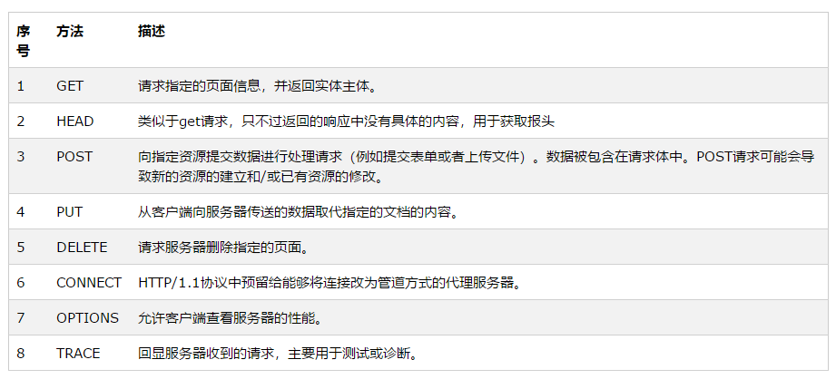

### 字节跳动实习3面offer+全职3面offer面经

本人20届计算机专业硕士，目标岗位服务端开发或者java开发 

  在头条有6次面试，3月份实习提前批的3次+7月份全职提前批的3次，都已获得offer，现将 **还记得的面试经历**分享出来。 

####   实习：

#####   一面：3月23日，一天三面面完，每场大概40分钟

*   [x] 进程和线程的区别，
*   [x] ArrayList和Linkedlist的区别，
*   [x] 说一下JVM内存模型，
*   [x] 垃圾回收算法
*   [x] cookie和session的区别 
*   [x] [算法]()：给定一个矩阵，从左上角开始只能往下或者右走，求到达右下角的最小权值路径 

#####   二面（问的量最大的一次，层层递进让我头皮发麻）： 

*   [ ] redis数据类型，redis缓存淘汰和key过期策略，redis缓存存在的问题（就是击穿雪崩内些）以及解决方法
*   [ ] 介绍一下mysql索引，聚集和非聚集索引区别，**索引为abc且查询条件为a=xxx order by b时能用上哪个索引**
*   [x] 说下http协议，和cookie有关的字段是哪个，content-type在传递表单数据的时候是什么值（这两个感觉偏前端了），urlencode是什么

*   [x] 描述java线程池添加任务的过程，
*   [x] 一致性哈希是什么
*   [x] hashmap的底层结构
*   [x] 布隆过滤器是什么
*   [x] mysql有哪些事务隔离默认的事务级别是什么 
*   [ ] 
     [算法]()：LRU写下大概的代码，单链表的回文判断要求O1空间 

#####   三面： 

*   [ ]   问答：自我介绍，一道大数据量的题目，A文件有3T，里面放的是uid+uname，B文件2T，里面放的是uid+unage，找出相同的uid并写成uid+uname+uage的样子，限制内存2G 

*   [ ] 
      算法：求一棵树的镜像，给我一个List，User有自己的id和父亲的id，要我转成一棵树    

#####   全职：分三天，每场大概20-30分钟 

#####   一面7.9： 

*   [x]   问答：线程池的工作流程，项目相关 

*   [x] 
      算法：有序链表的合并 

#####   二面7.12： 

*   [x]   问答：如何实现分布式锁（我只知道redis可以），一道控制QPS的题（不是很懂这题是啥意思，阿里之前也问过，一直没搞懂，希望有遇到类似的同学分享一下通用的解题思路），
*   [x] redis和java中原子类自增怎么是实现 
*   [x]   [算法]()：手写hashmap的put方法（不考虑扩容红黑的情况），
*   [x] 单链表的反转，单链表每k个翻转（看我写太快加了一道，1-2-3-4-5-6-7，k为3的话要变成3-2-1-6-5-4-7，我的思路是每K个截断，挨个翻转最后合并，On的空间，面试官说可以的，后来看leetcode有O1的空间，逻辑比较绕） 

#####   三面7.23：

*   [ ]   [算法]()：罗马数字字符串转阿拉伯数字（[leetcode]()上有），
*   [ ] 递增重复数组找target出现的范围（[0,1,1,1,2,3,4,4,5]，target为1的话要输出1的起始和结束下标即1和3，我的做法是两次二分，二分有两个能解决所有问题的模板，不用自己试边界问题， **在acwing上，我就是用的这个模板，yxc打钱**）

### 字节跳动（实习）后端一面面经

*   [x] 1.[算法题]() leetcode.42 接雨水 （根据他的提示写出了O(N2)的解法，优化没优化出来...） 

*   [x] 2.你对HTTP的了解有哪些（这咋说...就说了HTTP是干啥的，1.0和1.1的区别啥的） 

*   [ ] 3.HTTP有哪些请求方式（GET,POST,PUT,DELETE,TRACE，分别说了一下是做什么的。还有个OPTION忘了干啥的了就没说） 

    >   

*   [x] 4.IO复用了解吗？（只会概念，没怎么实践过），你说IO是阻塞的线程不安全的，怎么实现线程安全？你对阻塞怎么理解的，除了锁机制这块还有什么例子？ 

*   [x] 5.NIO底层实现了解吗？（不太了解，下一题..） 

*   [x] 6.说一下Lock和Synchronized的区别 [synchronized](.\并发&多线程\源码分析\synchronized关键字.md)

*   [x] 7.说一下公平锁和非公平锁你怎么理解的（参考ReentrantLock的底层实现） 

*   [ ] 8.Spring AOP的理解，哪里用到过？除了日志你还有什么地方用到过？ 

*   [x] 9.可达性分析[算法]()。 

    >   - 活动线程相关的各种引用。
    >   - 类的静态变量的引用。
    >   - JNI 引用。

*   [x] 10.说一下你对volatile的理解？（底层说了一下，Lock指令啥的）你刚说到本地内存和主内存，你说一下本地内存和主内存是在哪个区域的？ 

*   [x] 11.JVM内存分配，我引申到三个代咋分的，内部咋分的，各自回收算法

*   [x] 12.JVM除了堆还有啥？ 

*   [x] 13.垃圾回收器G1知道吗？ 

### 字节ea一面面经

*   [x] 算法题：加油站

*   [x] java创建线程的方式？ 

*   [x] threadlocal了解吗有什么用，threadlocal会产生什么问题？内存泄露。 为什么会threadlocal会产生内存泄露？ 

*   [x] 讲一下线程池类的核心参数? 

*   [x] hashmap和hashtable的区别？ 

    >   HashMap允许键和值是null，而Hashtable则不允许键或者值是null。
    >
    >   Hashtable是同步的，也就是线程安全的，而HashMap不是，所以**HashMap更适用于单线程环境，Hashtable则适用于多线程环境**
    >
    >   

*   [x] hashtable如何实现线程安全的？ 

*   [x] 其他线程安全的map？ 

*   [x] concurrentHashmap的底层原理？ 

*   [x] 超过最大核心线程数会报什么异常？ 

*   [x]  mysql索引失效的原因？五个。 
     mysql隔离级别，每个隔离级别会产生什么问题？四个 ，丢失修改，不可重复读，脏读，幻读。 
    
*   [x] 幻读和脏读的区别？幻读锁范围，脏读锁数据行。 

*   [x] 防止幻读？ 

*   [x] mvcc是什么? （多版本并发控制，同一行数据同时发生读写请求时，如何保证读写一致性，MVCC利用版本数据链，将修改的数据都通过指针存储起来）

*   [x] redis熟悉吗redis的数据类型？

*   [x] redis持久化的方式？rdb aof 

*   [x] rdb和aof的方式？ 

*   [x] tcp和udp的区别？ tcp为什么是四次挥手？ 数据大如何传输？ 

*   [x] 如何分片？ 分片之后怎么组合起来？ 

*   [x] tcp粘包？

*   [x]   Aio，Bio，Nio了解吗 [Java中的NIO和NIO的区别]

### 字节基础架构

##### **一面（约65min）：**

*   [x] 项目介绍，主要问了项目难点，如何解决 

*   [x] 知道object吗？和class有什么区别？object有啥方法？ 

*   [x] 用过哪些集合类？说说它们有什么区别？ 

*   [x] 进程和线程有什么区别？（答错了一点，以为线程崩溃会导致进程崩溃，其实不一定） 

    >    进程和线程都是一个时间段的描述，是CPU工作时间段的描述。是运行中的程序指令的一种描述，
    >
    >   1.   进程是操作系统资源分配的基本单位，而线程是处理器任务调度和执行的基本单位
    >   2.   资源开销：每个进程都有独立的代码和数据空间（程序上下文），程序之间的切换会有较大的开销；线程可以看做轻量级的进程，同一类线程共享代码和数据空间，每个线程都有自己独立的运行栈和程序计数器（PC），线程之间切换的开销小。
    >   3.   包含关系：如果一个进程内有多个线程，则执行过程不是一条线的，而是多条线（线程）共同完成的；线程是进程的一部分，所以线程也被称为轻权进程或者轻量级进程。
    >   4.   内存分配：同一进程的线程共享本进程的地址空间和资源，而进程之间的地址空间和资源是相互独立的
    >   5.   影响关系：一个进程崩溃后，在保护模式下不会对其他进程产生影响，但是一个线程崩溃整个进程都死掉。所以多进程要比多线程健壮。
    >   6.   执行过程：每个独立的进程有程序运行的入口、顺序执行序列和程序出口。但是线程不能独立执行，必须依存在应用程序中，由应用程序提供多个线程执行控制，两者均可并发执行

*   [ ] 你说进程和线程共享资源，那是共享什么资源呢？ 

*   [x] 进程的内存结构知道吗？ 

    >   *   代码区：存放CPU执行的机器指令，代码区是可共享，并且是只读的。
    >   *   数据区：存放已初始化的全局变量、静态变量（全局和局部）、常量数据。
    >   *   BBS区：存放的是未初始化的全局变量和静态变量。
    >   *   栈区：由编译器自动分配释放，存放函数的参数值、返回值和局部变量，在程序运行过程中实时分配和释放，栈区由操作系统自动管理，无须程序员手动管理。
    >   *   堆区：堆是由malloc()函数分配的内存块，使用free()函数来释放内存，堆的申请释放工作由程序员控制，容易产生内存泄漏。

*   [ ] linux了解吗？用过哪些原语？他们有什么区别？ 

*   [x] tcp和udp的区别？ 

*   [x] tcp三次握手的过程？（提了一嘴用过winsock） 

*   [x] 第三次握手发生在哪一个函数中？ 

*   [x] 函数如何实现的知道吗（确实不清楚） 

*   [x] [redis]()有哪些数据结构说一下？ 

*   [x] 为什么[redis]()快？（提了一嘴了解[redis]()高可用的一些知识） 

*   [x] 说说select，poll和epoll？ 

*   [x] 讲了讲[redis]()集群，主从复制，一致性hash等等操作。 

*   [ ] 做个题目： 一个升序数组找到中位数：（直接遍历，快排）

    ##### **二面（约65min）：**

    *   [x] 你能简单讲讲操作系统这门课程分成哪几部分吗，分别说一下 

        进程管理（进程线程，处理机调度，同步，死锁，），内存管理(虚拟机)，文件管理(磁盘调度)，输入输出，

    *   [x] 从键盘输入一个字母，到显示出来，经过了哪些步骤？ 

    *   [x] 你知道哪些页面置换算法？ 【最佳置换，先进先出最近最少使用，时间置换，LFU】

    *   [ ] linux常用命令你用过哪些？如何查看cpu占用情况？ 

        

    *   [x] 线程安全是什么？如何保证线程安全？ 

    *   [x] jvm了解吗，它的结构是什么样的，分别有什么作用？ 

    *   [x] volatile的底层实现？ 
    
    *   [ ] 写个题：折叠链表，没运行，写完和面试官探讨了奇数偶数会不会有问题，然后自己加了一些判断进去。 

##### **三面（约55min）：**

*   [ ] linux了解多少？平时用的多吗？如果我要看某个进程cpu占用，怎么写，线程呢，greb 参数有什么，等等 ？（具体到每一个参数） 

    >   linux grep 命令用于查找文件里符合条件的字符串,

*   [ ] 线程池了解吗？参数有哪些？如何实现的？ 

*   [x] redis淘汰策略说一下？ 

*   [x] mysql了解吗？引擎有哪些？都说一下 

*   [x] 你说你项目用了mysql + [redis]()，[redis]()缓存了什么呢？为什么要这样做？ 

*   [x] 如何保证mysql和[redis]()的数据一致？ 

*   [x] 说说binlog和redolog？ 

*   [ ] 写个题：翻转链表，忘记返回最终的头结点，导致输出一直为空，调试了10min非常慌。 

*   [ ] 有什么要问的？时间问题就问一个吧，我问了三个🤣，实习生要求；工作内容；面试评价；

### 字节头条

##### **一面（约55min）：** 

*   [ ] 项目相关，也说了很多 
*   [ ] 执行一个可执行文件发生了什么？（真的爱问操作系统🤣，我还答得不是很好，主要说了资源分配部分，具体到哪些资源，如何分配，面试官想让我说缺页中断啥的） 
*   [ ] 说说缺页中断（引申到了mmap和directIO） 
*   [x] sychronize和lock的区别？（Reentrantlock底层说了不少） 
*   [x] mysql的innodb用了什么数据结构呢？有什么好处？和红黑树有什么区别，avl了解吗？相关操作的时间复杂度？ 
*   [ ] 1.接雨水，题目一来，我哦了一声，结果面试官问我是不是写过，我老实地说是了，他说让我说说思路， 
*   [ ] 2.一个数组分成左右两部分，求左右两部分最大值的和（还是最小差值？又忘了😅）。 

##### **二面（约55min）：** 

  应该是压力面，面试官比较严肃，全程 “行吧”，“就这样吧” 

*   [x] 介绍项目，爆怼，时间比较久。 
*   [x] 了解jvm的垃圾收集[算法]()吗，说一下？ 
*   [x] g1和cms有什么区别（回答得比较细，rset，point-in，增量快照等等） 
*   [x] cms的问题在哪？（内存碎片太多了（好像默认是45%）会标记整理一次，耗时较久），那怎么解决
*   [x] 你说最近深入学了下zookeeper，知道cap吗？是用来衡量什么的？ 
*   [x] 选举机制说一下？集群之间如何进行投票？ 
*   [x] 两个升序数组，求中位数，leetcode 4.寻找两个正序数组的中位数 

### 抖音电商一面

 注：面试官特别友善，面试体验特别好 

*   [ ] ArrayList的扩容是怎么实现？ 

    每次扩容1.5倍，使用system.arrcopy

*   [ ] 介绍一下hashmap，介绍一下put操作做了哪些步骤？（问了细节） 

    

*   [ ] hashmap判定重复是==还是equals 

    

*   [ ]  hashmap1.7和1.8？ 

*   [ ] hashMap是线程安全吗？介绍一下concurrentHashMap?如何保证线程安全的同时保证吞吐量？ 

    

*   [x]  synchronized在jdk1.8做了哪些优化？ 

*   [x]  synchronized为什么要设计成可重入？ 

*   [x]  volatile的原理？解决什么问题？ 

*   [x]  介绍一下JMM 

*   [x]  Lock接口？了解过AQS嘛？ 

*   [x] ReentrantLock可以做公平锁吗？怎么实现公平锁？ 

    >    默认非公平锁，在构造方法中传入true是公平锁，公平锁的tryAcquire上有hasQueuedPredecessors在获取锁的时候判断队列有没有等待的
    >
    >   **非公平锁和公平锁的两处不同：** 
    >
    >   ​		1. 非公平锁在调用 lock 后，首先就会调用 CAS 进行一次抢锁，如果这个时候恰巧锁没有被占用，那么直接就获取到锁返回了。
    >
    >   非公平锁在 CAS 失败后，和公平锁一样都会进入到 tryAcquire 方法，在 tryAcquire 方法中，如果发现锁这个时候被释放了（state == 0），非公平锁会直接 CAS 抢锁，但是公平锁会判断等待队列是否有线程处于等待状态，如果有则不去抢锁，乖乖排到后面。
    >
    >   公平锁和非公平锁就这两点区别，如果这两次 CAS 都不成功，那么后面非公平锁和公平锁是一样的，都要进入到阻塞队列等待唤醒。

*   [ ]  算法题：用栈实现队列（Leetcode）其中栈的数据结构也自己实现

*   [ ]  String s1 = “abc” String s2 = new String(“abc”）两个语句分别创建了几个对象？对象存储的位置？s1和s2相等吗？执行顺序先是第一条再是第二条创建几个对象？ 

*   [x]  interface和abstract的区别 

*   [ ] abstract抽象类里面一定要有抽象方法吗？ 

    >   不一定，但是一个类包含抽象方法，则该类必须是抽象类

*   [ ] interface可以写方法的实现吗？ （不可以）

*   [x] jvm的类加载机制？ 

*   [x] 双亲委派机制？ 

*   [x]  TCP属于网络的哪一层？ 

*   [x]  TCP是面向连接的？为什么三次握手？ 

*   [x]  TCP怎么保证可靠传输？ 

*   [ ]  滑动窗口的大小由哪一端来控制？server为什么要控制？client为什么要控制？ 

*   [ ]  拥塞控制知道吗？ 

*   [x]  mysql联合索引一道题目：建立了联合a，b，c。 a，b，c会走索引吗？a，c会走索引吗？

*   [ ]  *算法题：*无重复字符的最长子串

*   [ ]  你有什么问题要问我吗？问了一下业务？问了一下什么语言？

    

    ### 二面 

    *   [ ] 自我介绍 
    
    *   [ ] 介绍一下springMVC和Springboot和Mybatis 
    
    *   [ ] springMVC的一些细节 
    
    *   [ ] springboot的作用 
    
    *   [x] 介绍几种[排序]()[算法]()，时间复杂度，空间复杂度 
    
    *   [x] 桶[排序]() 
    
    *   [x] 快速[排序]() 
    
    *   [x] *[算法题]()**：实现快速[排序]()* 
    
    *   [x] 堆[排序]()怎么实现 
    
    *   [x] 数据结构中图的表示有哪些 

    *   [x] 哪种情况下用矩阵、哪种情况下用邻接表 

    *   [ ] 求两个点之间的最短距离？介绍一下迪杰斯特拉算法？ 

    *   [x] 介绍一下事务？ 

    *   [x] 介绍一下三大范式？ 

    *   [ ] 进程和线程的区别 

    *   [x] 进程调度有哪几种方式？有哪几种评价方式？ 
    
        先来先服务，短作业优先
    
    *   [x] 介绍一下虚拟内存？为什么使用虚拟内存？（两种优点） 
    
        1、虚拟内存的优点：1内存隔离，2可以弥补物理内存大小的不足；一定程度的提高反映速度；3减少对物理内存的读取从而保护内存延长内存使用寿命；
        2、虚拟内存的缺点：占用一定的物理硬盘空间；加大了对硬盘的读写；设置不得当会影响整机稳定性与速度。
    
    *   [x] 算法题对无序的链表进行排序（不可以使用Java中的容器）     相关知识点：链表排序
        
    
    ###  三面
    
    *   [x] 自我介绍 
    
    *   [x] 学校里学的哪些课程比较受用？ 
    
    *   [ ] 一个指令从软件到操作系统到硬件执行？整个过程做了哪些？ 
    
    *   [x] 启动一个应用，监听一个端口对外服务？启动服务以后，本身没有问题，但是客户端连不到服务？如何诊断？ 
    
        >   1.   检查防火墙
        >2.   提供端口对外服务的测试一下
        
    *   [x] 一个url从输入到页面解析的过程？ 
    
    *   [x] DNS用什么传输协议？ 
    
        >   https://www.zhihu.com/question/310145373
        >
        >   响应时间= DNS域名解析时间 + TCP 连接建立时间 + HTTP交易时间
        >
        >   DNS域名解析时间 = ~~TCP连接时间~~ + DNS交易时间
        >
        >   DNS限制报文不超过576，所以将DNS报文限制在512字节,当超过512字节，DNS只能将超过的字节给丢掉，因为他没有TCP那样的序号，不能进行重组，为了克服这种困难，所以当报文比较长的时候，并且想要相对比较安全的时候，就会直接采用TCP来进行传输。
    
    *   [x] 用户如何找到DNS服务器？ 
    
    *   [x] DNS服务器是怎么知道IP地址的？如何知道去哪里找DNS服务器？ 
    
    *   [x] JDK和JRE的区别？ 
    
    *   [x] 类加载的机制？ 
    
    *   [x] 一道问题，有关于Java的值传递 
    
    *   [ ] *手撕sql* employee(id, name, salary) office(id, city) 写一个sql，输出每个城市收入最高的员工的名字？后面改成每个城市收入最高的收入? 
    
    *   [ ] 算法题：下一个排列（Leetcode）
    
    *   [ ]  **数学题**：参加一个游戏节目，你是参赛者，主持人会在你的前面放三个盒子，其中一个盒子藏奖品，你选中一个盒子之后，主持人会开启另外两个中没奖品的一个盒子，剩下一个盒子。请问现在有机会让你换成另外一个盒子，你换盒子和不换盒子的中奖概率是怎么样的？ 