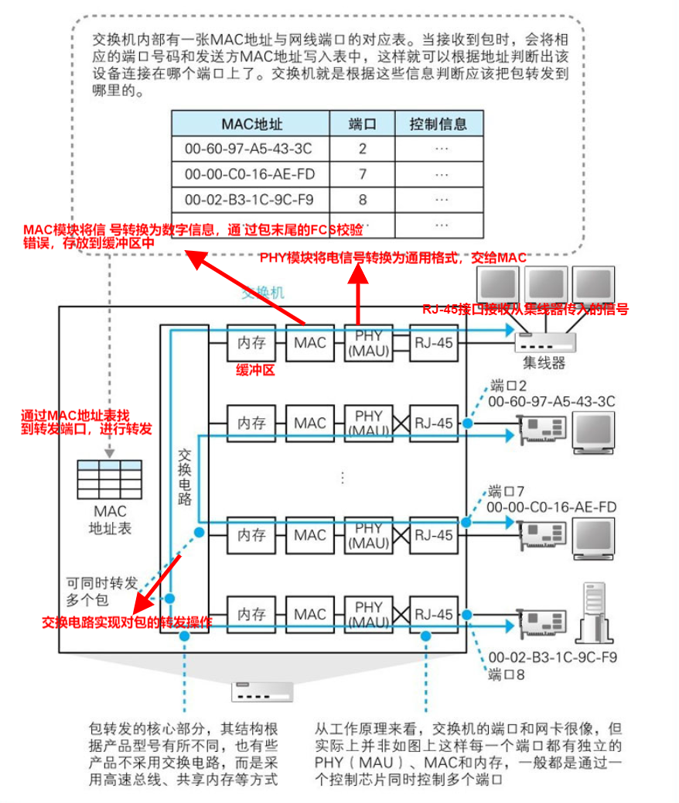

第3章 集线器、交换器和路由器
----------------------------

上一章我们介绍了应用程序将HTTP消息封装好后交给TCP/IP协议,TCP加上TCP头部，交由IP模块，添加上ip头部后将网络报转化为电信号通过网线传输出去的过程；本章我们将了解网线传出去的包是如何通过集线器，交换机，路由器等网络设备进入互联网的。

### 信号在网线和集线器中传输

网络包从客户端计算机发出之后，要经过**集线器、交换机和路由器**最终进入互联网。实际上，我们家里用的**路由器已经集成了集线器和交换机的功能**，像图上这样使用独立设备的情况很少见。不过，把每个功能独立出来更容易理解

##### 防止网线中的信号衰减很重要

##### “双绞”是为了抑制噪声

局域网网线使用的是双绞线，其中“双绞”的意思就是以两根信号线为一组缠绕在一起，这种拧麻花一样的设计是为了抑制噪声的影响，

***为什么能抑制噪声：***1.产生噪声的原因是网线周围的电磁波，当电磁波接触到金属等导体时，在其中就会产生电流。因此，如果网线周围存在电磁波，就会在网线中产生和原本的信号不同的电流。由于信号本身也是一种带有电压变化的电流，其本质和噪声产生的电流是一样的，所以信号和噪声的电流就会混杂在一起，导致信号的波形发生失真 2.信号线是用金属做成的，当电磁波接触到信号线时，会沿电磁波传播的右旋方向产生电流，这种电流会导致波形发生失真。如果我们将信号线缠绕在一起，信号线就变成了螺旋形，其中两根信号线中产生的噪声电流方向就会相反，从而使得噪声电流相互抵消，噪声就得到了抑制。当然，即便信号线变成螺旋形，里面的信号依然可以原样传输，也就是说，信号没有变，只是噪声被削弱了

##### 集线器将信号发往所有线路

**集线器的作用就是将信号广播到整个网络，与集线器相连的设备根据接收方MAC地址来判断应该接收哪些包。**

集线器的接口中有一个MDI/MDI-X切换开关, MDI就是对RJ-45接口和信号收发模块进行直连接线，而MDI-X则是交叉接线。由于集线器的接口一般都是MDI-X模式，要将两台集线器相连时，就需要将其中一台改成MDI模式,所以发送线路和接收线路的两端需要**交叉连接**

### 交换机的包转发操作

##### 交换机根据地址表进行转发

> 本节介绍交换机是怎么接受从集线器过来的信号，然后判断MAC地址进行转发到正确的端口的

以上就是交换机进行包转发的全部过程。

下面介绍交换电路的实现原理

注意：在端口处进行包转发操作的时候，需要确认没有其他设备在发送信号，如果检测到其他设备在发送信号，则需要等待信号发送完毕；如果没有其他信号，或者其他信号已经发送完毕，这时就可以将包的数字信息转换为电信号发送出去。在发送信号的过程中，还需要对接收信号进行监控，。如果在发送过程中检测到其他设备发送信号，就意味着出现了信号碰撞，这时需要发送阻塞信号以停止网络中所有的发送操作，等待一段时间后再尝试重新发送。

##### MAC地址表的维护

上面寻找转发端口的MAC地址表需要维护，维护操作分为两种

第一种是收到包时，将发送方MAC地址以及其输入端口的号码写入MAC地址表中。

另一种是删除地址表中某条记录的操作，这是为了防止设备移动时产生问题。

##### 特殊操作

交换机查询地址表之后发现记录中的目标端口和这个包的源端口是同一个端口怎么办？（直接丢弃这个包）

地址表中找不到指定的MAC地址？（将包转发到除了源端口之外的所有端口，无论该设备连接在哪个端口上都能收到这个包。只有相应的接收者才接收包，而其他设备则会忽略这个包）

##### 全双工模式可以同时进行发送和接收

全双工模式是交换机特有的工作模式，它可以**同时进行发送和接收操作**，集线器不具备这样的特性。

##### 自动协商：确定最优的传输速率

在以太网中，当没有数据在传输时，网络中会填充一种被称为**连接脉冲的脉冲信号**。在没有数据信号时就填充连接脉冲，这使得网络中一直都有一定的信号流过，从而能够检测对方是否在正常工作，或者说网线有没有正常连接。以太网设备的网线接口周围有一个**绿色的LED指示灯**，它表示是否检测到正常的脉冲信号。如果绿灯亮，说明PHY（MAU）模块以及网线连接正常。

后来通过这样的脉冲信号，将自己能够支持的工作模式和传输速率相互告知对方，并从中选择一个最优的组合。

##### 交换机可同时执行多个转发操作

**交换机转发能力高于集线器**

### 路由器的包转发操作

##### 路由器转发过程

网络包经过集线器和交换机之后，现在到达了路由器，并在此被转发到下一个路由器。这一步转发的工作原理和交换机类似，也是**通过查表判断包转发的目标**，但路由器是基于IP设计的，而交换机是基于以太网设计的

下面是路由器的内部结构图：

路由器的**端口模块**则支持除局域网之外的多种通信技术，如ADSL、FTTH，以及各种宽带专线等，只要端口模块安装了支持这些技术的硬件即可，

总体过程为：1. 首先会通过端口将发过来的包接收进来，这一步的工作过程取决于端口对应的通信技术。对于以太网端口来说，就是按照以太网规范进行工作，而无线局域网端口则按照无线局域网的规范工作，总之就是委托端口的硬件将包接收进来。2.接下来，**转发模块会根据接收到的包的IP头部中记录的接收方IP地址，在路由表中进行查询，以此判断转发目标**。3.然后，转发模块将包转移到转发目标对应的端口，端口再按照硬件的规则将包发送出去，也就是转发模块委托端口模块将包发送出去的意思

对于路由器而言，**路由器的各个端口都具有MAC地址和IP地址**，所以它执行包收发操作是以实际的发送方或者接收方的身份来收发网络包的，以以太网端口为例，路由器的端口具有MAC地址，因此它就能够成为以太网的发送方和接收方。端口还具有IP地址，从这个意义上来说，它和计算机的网卡是一样的。当转发包时，首先路由器端口会接收发给自己的以太网包，然后查询转发目标，再由相应的端口作为发送方将以太网包发送出去

##### 路由表中的信息

路由表的作用是**查表判断转发目标**，这和交换机有些类似，不过交换机是通过MAC头部中的接收方MAC地址来判断转发目标的，而路由器则是根据IP头部中的IP地址来判断的。由于使用的地址不同，记录转发目标的表的内容也会不同。

主要结构如下：

路由聚合：

路由表的维护：

（a）由人手动维护路由记录

（b）根据路由协议机制，通过路由器之间的信息交换由路由器自行维护路由表的记录(RIP、OSPC、BGP协议等)

##### 路由器的包接收操作

##### 查询路由表确定输出端口

完成包接收操作之后，路由器就会丢弃包开头的MAC头部。MAC头部的作用就是将包送达路由器，其中的接收方MAC地址就是路由器端口的MAC地址。因此，当包到达路由器之后，MAC头部的任务就完成了，于是MAC头部就会被丢弃。

接着就会根据MAC地址后边的IP地址再次进行包转发，最主要的就是找到下一个的转发地址（根据目标地址+子网掩码）

##### 找不到匹配路由时选择默认路由（默认网关）

如果找不到合适的路由时，我们会额外设置一个**子网掩码0.0.0.0**：网络包接收方IP地址和路由表目标地址的匹配中需要匹配的比特数为0，也就是说根本不需要匹配。只要将子网掩码设置为0.0.0.0，那么无论任何地址都能匹配到这一条记录，这样就不会发生不知道要转发到哪里的问题了。这样网络包就会被转发到**互联网接入路由器**。因此这条记录被称为**默认路由**，这一行配置的网关地址被称为**默认网关**

##### 包的有效期

IP头部中的**TTL（Time to Live**，生存时间）字段(防止网络报在网络中无限循环)

##### 通过分片功能拆分大网络包

不同的线路和局域网类型各自能传输的最大包长度也不同，因此**输出端口的最大包长度可能会小于输入端口**，一旦转发的包长度超过了输出端口能传输的最大长度，就无法直接发送这个包了。所以就需要使用分片 功能来拆分大的网络包（这里拆分的是完整的包，而不是数据）。如果查询标志字段发现不能分片，那么就只能丢弃这个包，并通过**ICMP消息通知发送方**。否则，就可以按照**输出端口MTU对数据进行依次拆分**了。在分片中，**TCP头部及其后面的部分都是可分片的数据**，尽管TCP头部不属于用户数据，但从IP来看也是TCP请求传输的数据的一部分。**数据被拆分后，每一份数据前面会加上IP头部**，其大部分内容都和原本的IP头部一模一样，但其中有部分字段需要更新，这些字段用于记录分片相关的信息。

##### 路由器的发送操作和计算机相同

发送前的准备工作就完成后，接下来就会进入**包的发送操作**。

主要有以下几个操作：

1. 判断MAC头部中的MAC地址应该填写什么值
2. 填写发送方MAC地址字段
3. 转换成电信号并通过端口发送出去（碰撞检测）
4. 输出端口为以太网，则发送出去的网络包会通过交换机到达下一个路由器（MAC地址也是下一个路由器的地址）

##### 路由器与交换机的关系

IP （路由器）负责将包发送给通信对象这一整体过程，而其中将包传输到下一个路由器的过程则是由以太网（交换机）来负责的。IP本身不负责包的传输，而是委托各种通信技术将包传输到下一个路由器，例如委托以太网，无线局域网，互联网等等通信技术

### 路由器的附加功能

> 地址转换和包过滤
